<div align="center">

<!-- ═══════════════════════════════════════════════════════════════════════════ -->
<!-- HELIX BANNER -->
<!-- ═══════════════════════════════════════════════════════════════════════════ -->

<picture>
  <source media="(prefers-color-scheme: dark)" srcset="assets/logo-banner.svg">
  <source media="(prefers-color-scheme: light)" srcset="assets/logo-banner.svg">
  
</picture>

<br/>
<br/>

### *A Modern Operating System Built for Safety and Simplicity*

<br/>

[](LICENSE)
[](https://www.rust-lang.org/)
[](#status)

<br/>

[📖 Documentation](docs/) · [🏛️ Architecture](#architecture) · [🚀 Getting Started](#getting-started)

</div>

---

## The Vision

Operating systems have carried decades of legacy. They were designed in an era of scarcity—limited memory, single cores, and hardware that failed unpredictably. We've inherited their complexity.

**Helix asks: what if we started fresh?**

Built entirely in Rust, Helix eliminates entire classes of vulnerabilities at compile time. Its microkernel architecture keeps the trusted core minimal. Its declarative interface layer—**Prism**—treats the UI as structured data, not imperative code. The result is an OS that is secure by construction, not by convention.

This is not production software. This is a research platform exploring what comes next.

---

## Architecture

Helix is structured in clean, isolated layers. Each layer has one responsibility.

```mermaid
flowchart TB
    subgraph Interface["✨ Interface Layer"]
        PRISM["Prism Engine"]
        HXML["HXML Markup"]
    end

    subgraph Userland["🔷 Userland"]
        APPS["Applications"]
        SERVICES["System Services"]
    end

    subgraph Core["⚙️ Core"]
        SCHED["Scheduler"]
        MEM["Memory"]
        IPC["Message Bus"]
        FS["Filesystem"]
    end

    subgraph Foundation["🔧 Foundation"]
        HAL["Hardware Abstraction"]
        DRIVERS["Device Drivers"]
    end

    Interface --> Userland
    Userland --> Core
    Core --> Foundation

    style Interface fill:#2d1b4e,stroke:#a78bfa,stroke-width:2px
    style Userland fill:#1a2744,stroke:#60a5fa,stroke-width:1px
    style Core fill:#1a2e1a,stroke:#4ade80,stroke-width:1px
    style Foundation fill:#2a1a1a,stroke:#f97316,stroke-width:1px
```



| Layer | Purpose |
|-------|---------|
| **Interface** | Declarative UI via Prism and HXML markup |
| **Userland** | Applications and privileged system services |
| **Core** | Minimal microkernel: scheduling, memory, IPC |
| **Foundation** | Hardware abstraction and device drivers |

---

## Key Features

### 🦀 Memory Safety by Default

The entire system is written in Rust. No C. No undefined behavior. Buffer overflows, use-after-free, and data races are compile-time errors.

### 🔬 Microkernel Design

The kernel does exactly three things: manage memory, schedule processes, and pass messages. Everything else—drivers, filesystems, networking—runs in isolated userspace.

### ✨ Prism & HXML

The interface layer is declarative. UI is defined in **HXML**—a structured markup language—and rendered by the **Prism** engine. No callback spaghetti. State flows in one direction.

```xml
<window title="Hello">
  <text>Welcome to Helix.</text>
  <button action="close">Exit</button>
</window>
```

### 🔄 Hot Reload

Kernel modules can be replaced at runtime without rebooting. Update a driver, fix a bug, evolve the system—while it runs.

### 🛡️ Fault Isolation

Crashed components don't crash the system. Services are sandboxed. Failures are contained, logged, and recovered.

---

## Status

Helix is under active research and development.

| Component | State |
|-----------|-------|
| Microkernel (scheduler, memory, IPC) | ✅ Functional |
| Hardware Abstraction Layer | ✅ Functional |
| Filesystem | ✅ Functional |
| Device Drivers | 🔵 In Progress |
| Prism UI Engine | 🔵 In Progress |
| Networking | ⚫ Planned |
| POSIX Compatibility | ⚫ Planned |

> ⚠️ This is a research project. It is not suitable for production use.

---

## Getting Started

### Requirements

- Rust nightly toolchain
- QEMU (for virtualized testing)

### Build & Run

```bash
# Clone
git clone https://github.com/HelixOSFramework/helix.git
cd helix

# Setup toolchain
rustup default nightly
rustup target add x86_64-unknown-none
rustup component add rust-src llvm-tools-preview

# Build
./scripts/build.sh

# Run in QEMU
./scripts/run_qemu.sh
```

---

## Learn More

| Resource | Description |
|----------|-------------|
| [Architecture](docs/ARCHITECTURE.md) | Technical design documentation |
| [Module Guide](docs/MODULE_GUIDE.md) | Writing kernel modules |
| [Contributing](docs/development/CONTRIBUTING.md) | How to contribute |

---

## License

MIT License. See [LICENSE](LICENSE).

---

<br/>

<div align="center">

<!-- ═══════════════════════════════════════════════════════════════════════════ -->
<!-- FOOTER -->
<!-- ═══════════════════════════════════════════════════════════════════════════ -->

<picture>
  <source media="(prefers-color-scheme: dark)" srcset="assets/nexus-logo-minimal.svg">
  <source media="(prefers-color-scheme: light)" srcset="assets/nexus-logo-minimal.svg">
  
</picture>

<br/>
<br/>

**Helix OS**

*Rethinking the foundation.*

<br/>

[](https://github.com/HelixOSFramework/helix)

</div>
