<div align="center">

<!-- ═══════════════════════════════════════════════════════════════════════════ -->
<!-- HELIX BANNER -->
<!-- ═══════════════════════════════════════════════════════════════════════════ -->

<picture>
  <source media="(prefers-color-scheme: dark)" srcset="assets/logo-banner.svg">
  <source media="(prefers-color-scheme: light)" srcset="assets/logo-banner.svg">
  
</picture>

<br/>

### ⚡ The AI-Native Rust Kernel Framework

> *Don't build on top of an OS. Build the OS.*

<br/>

[](LICENSE)
[](https://www.rust-lang.org/)
[](#)
[](#status)
[](#)

<br/>

[📖 Docs](docs/) · [🏛️ Architecture](#architecture) · [🚀 Quick Start](#getting-started) · [🗺️ Roadmap](#roadmap) · [🤝 Contribute](#contributing)

</div>

---

## Why Helix?

Most operating systems are monoliths carrying decades of C legacy. They bolt on safety, modularity, and intelligence as afterthoughts. **Helix starts from zero — with all three as foundational principles.**

Helix is not just an operating system. It's a **framework for creating operating systems** — a composable, policy-free kernel where every major component (scheduler, allocator, filesystem, drivers) is a **swappable module** that can be replaced *at runtime, without rebooting*.

Three things make it different:

- **🦀 Memory Safety as a Guarantee, Not a Goal.** Written entirely in Rust `no_std`. Zero C code. Buffer overflows, use-after-free, and data races are compile-time errors — not CVEs waiting to happen.

- **🧠 AI at the Kernel Level.** The **Nexus** subsystem embeds predictive intelligence, self-healing, and cognitive reasoning directly into the kernel. Crash prediction 30 seconds ahead. Automatic module recovery without reboot. A kernel that *learns*.

- **🔄 True Hot-Reload.** Swap a scheduler algorithm. Patch a driver. Upgrade the filesystem — all while the system is running. Atomic state migration with automatic rollback on failure.

This is what happens when you design an OS for the next decade, not the last one.

---

## Key Features

### 🏗️ Framework Architecture — Build *Your* OS

Helix separates **mechanism** from **policy**. The kernel provides frameworks; modules provide implementations. Compose exactly the OS you need:

| You Choose | Available Modules |
|:-----------|:------------------|
| **Scheduler** | Round-Robin, CFS, Real-Time, Cooperative *(pluggable)* |
| **Allocator** | Buddy, Slab, TLSF *(pluggable)* |
| **Filesystem** | HelixFS (CoW), RamFS *(pluggable)* |
| **Boot Protocol** | Limine · UEFI · Multiboot2 |
| **Profile** | Minimal · Desktop · Server · Embedded · Secure |

### 🧠 Nexus — Kernel-Native Intelligence

The **Nexus** subsystem is a first-of-its-kind cognitive framework embedded in the kernel:

- **Prediction** — Anticipate failures and resource bottlenecks before they happen
- **Self-Healing** — Detect crashed modules, restart them, migrate state — automatically
- **Cognitive Layers** — Perception → Comprehension → Reasoning → Decision → Action → Meta-Cognition
- **Evolution** — Genetic optimization and runtime self-adaptation (sandbox-guarded, capability-gated)

> 5-year roadmap: *Genesis → Cognition → Evolution → Symbiosis → Transcendence*

### 🔄 Hot-Reload Engine

Replace kernel modules at runtime with zero downtime:

```
Pause → Snapshot State → Unload Old → Load New → Restore State → Resume
```

Automatic rollback if the new module fails. State is serialized and migrated across versions with ABI compatibility checks.

### 📂 HelixFS — Next-Generation Filesystem

A **Copy-on-Write** filesystem designed for reliability and modern workloads:

- **Instant Snapshots** — O(1) via CoW semantics
- **Temporal Versioning** — Built-in file history with point-in-time recovery
- **Adaptive Compression** — Per-extent algorithm selection
- **Encryption** — AEAD with per-file keys
- **Integrity** — Merkle DAG verification
- **Crash Consistency** — Transactional writes, never overwrites in place

### 🖥️ Industrial-Grade HAL

A trait-based Hardware Abstraction Layer with first-class multi-architecture support:

- **x86_64** — APIC/x2APIC, 4/5-level paging, MSR, CPUID, TSS/IST, PIT/HPET/TSC timers
- **AArch64** — GIC, ARM MMU, PSCI, exception handling
- **RISC-V 64** — PLIC, Sv39/Sv48/Sv57 paging, SBI interface

All sharing a unified trait interface — write once, boot everywhere.

### 🎨 Lumina — GPU Rendering Stack

A 21-crate graphics engine with a full shader compilation pipeline:

```
Shader Source → lumina-ir → lumina-spirv → SPIR-V Binary → GPU
```

3D rendering, material systems, scene graphs, asset management, and a UI toolkit — all `no_std` compatible.

### 🔒 Security by Design

- **Minimal TCB** — ~5,000 lines of critical Rust + ~500 lines of assembly
- **Capability-Based Security** — Fine-grained permission model for all modules
- **Fault Isolation** — Crashed components never cascade; failures are contained and recovered
- **Secure Boot** — Full UEFI Secure Boot, TPM 2.0, cryptographic signature verification

---

## Architecture

Helix is structured in **7 clean layers**, each with a single responsibility:

```mermaid
flowchart TB
    subgraph L7["🌐 Layer 7 — Userland Interface"]
        POSIX["POSIX Shim"]
        NATIVE["Native API"]
        WASM["WASM Runtime"]
    end

    subgraph L6["📋 Layer 6 — Policy"]
        SEC_POL["Security"]
        RES_POL["Resources"]
        SCHED_POL["Scheduling"]
    end

    subgraph L5["📡 Layer 5 — Message Bus"]
        HMF["Helix Message Fabric"]
    end

    subgraph L4["📦 Layer 4 — Module Runtime"]
        REG["Registry"]
        HOTRL["Hot-Reload"]
        DEP["Dependency Resolver"]
    end

    subgraph L3["⚙️ Layer 3 — Subsystems"]
        EXEC["Execution"]
        MEM["Memory"]
        NEXUS["Nexus AI"]
        FSYS["HelixFS"]
    end

    subgraph L2["🔷 Layer 2 — Core"]
        ORCH["Orchestrator"]
        SYSCALL["Syscall Gateway"]
        IRQ["Interrupt Router"]
    end

    subgraph L1["🔧 Layer 1 — Boot & HAL"]
        BOOT["Limine · UEFI · Multiboot2"]
        HAL["HAL: x86_64 · AArch64 · RISC-V"]
    end

    L7 --> L6 --> L5 --> L4 --> L3 --> L2 --> L1

    style L7 fill:#2d1b4e,stroke:#a78bfa,stroke-width:2px
    style L6 fill:#1a2744,stroke:#60a5fa,stroke-width:1px
    style L5 fill:#1a3a2e,stroke:#22d3ee,stroke-width:1px
    style L4 fill:#2a2a1a,stroke:#facc15,stroke-width:1px
    style L3 fill:#1a2e1a,stroke:#4ade80,stroke-width:1px
    style L2 fill:#1a1a2e,stroke:#818cf8,stroke-width:1px
    style L1 fill:#2a1a1a,stroke:#f97316,stroke-width:1px
```



### How Profiles Work

Profiles are **compositions** — they select which modules to include in a final OS image. The `minimal` profile wires up a basic scheduler, bump allocator, and serial console. A `desktop` profile would add Lumina, a full filesystem, and networking. The kernel core stays the same — only the modules change.

```
profiles/minimal  →  selects: Round-Robin Scheduler + Bump Allocator + Serial Console
profiles/desktop  →  selects: CFS Scheduler + Slab Allocator + Lumina + HelixFS + Network Stack
profiles/embedded →  selects: Cooperative Scheduler + TLSF Allocator + Minimal I/O
```

> **The kernel provides the mechanisms. Your profile provides the policy.**

---

## Getting Started

### Prerequisites

- **Rust** nightly toolchain (managed via `rust-toolchain.toml` — automatic)
- **QEMU** for virtualized testing
- **GNU Make** or **just** (optional, for convenience targets)

### Build & Run

```bash
# Clone the repository
git clone https://github.com/HelixOSFramework/helix.git
cd helix

# The toolchain is pinned — rustup handles it automatically
rustup component add rust-src llvm-tools-preview

# Build the kernel
./scripts/build.sh

# Boot in QEMU
./scripts/run_qemu.sh
```

### Other Commands

```bash
# Build with debug symbols
./scripts/build.sh --debug

# Run unit tests
cargo test --target x86_64-unknown-linux-gnu --lib

# Run the full test suite
./scripts/test.sh

# Format & lint
cargo fmt --all
cargo clippy --all-targets --all-features -- -D warnings

# Generate documentation
cargo doc --no-deps --document-private-items --open

# Create a bootable ISO
./scripts/build.sh --iso
```

---

## Status

<table>
<tr><th>Component</th><th>State</th><th>Details</th></tr>
<tr><td><b>Boot (Limine)</b></td><td>✅ Complete</td><td>All 18 request types, SMP, framebuffer, multi-arch</td></tr>
<tr><td><b>Boot (UEFI)</b></td><td>✅ Complete</td><td>134K+ lines — Secure Boot, TPM, GOP, PXE, recovery mode</td></tr>
<tr><td><b>Boot (Multiboot2)</b></td><td>✅ Complete</td><td>Standard protocol support</td></tr>
<tr><td><b>HAL (x86_64)</b></td><td>✅ Complete</td><td>APIC, paging, timers, segmentation, SMP</td></tr>
<tr><td><b>Kernel Core</b></td><td>✅ Functional</td><td>Orchestrator, syscalls, interrupts, panic handling</td></tr>
<tr><td><b>Execution Subsystem</b></td><td>✅ Functional</td><td>Scheduler framework + Round-Robin implementation</td></tr>
<tr><td><b>Memory Subsystem</b></td><td>✅ Functional</td><td>Allocator framework, physical/virtual memory management</td></tr>
<tr><td><b>Module System</b></td><td>✅ Functional</td><td>Registry, hot-reload, dependency resolution</td></tr>
<tr><td><b>HelixFS</b></td><td>✅ Functional</td><td>CoW, snapshots, compression, encryption</td></tr>
<tr><td><b>Self-Healing</b></td><td>✅ Functional</td><td>Watchdog, health monitoring, automatic recovery</td></tr>
<tr><td><b>Nexus AI</b></td><td>🔵 In Progress</td><td>Year 1 (Genesis) — hardening, prediction, self-healing</td></tr>
<tr><td><b>Lumina Graphics</b></td><td>🔵 In Progress</td><td>21 crates — shader pipeline, 3D, materials</td></tr>
<tr><td><b>Device Drivers</b></td><td>🔵 In Progress</td><td>Serial, VirtIO planned</td></tr>
<tr><td><b>Networking</b></td><td>⚫ Planned</td><td>TCP/IP stack</td></tr>
<tr><td><b>POSIX Compatibility</b></td><td>⚫ Planned</td><td>Shim layer for standard applications</td></tr>
</table>

> ⚠️ **Helix is a research project under active development.** It is not yet suitable for production use.

---

## Roadmap

### 🧬 Nexus AI — 5-Year Vision

| Year | Codename | Theme |
|:-----|:---------|:------|
| **2026** | **Genesis** | Structural Intelligence — fuzzing, prediction, self-healing, SIMD acceleration |
| **2027** | **Cognition** | Causal Reasoning — perception, anomaly detection, planning, meta-cognition |
| **2028** | **Evolution** | Self-Evolution — genetic optimization, runtime code synthesis, NAS |
| **2029** | **Symbiosis** | Kernel/Userland Symbiosis — federated learning, cooperative AI |
| **2030** | **Transcendence** | Emergent Intelligence — autonomous kernel decision-making |

### 🛠️ Kernel Roadmap

- **Scheduler Implementations** — CFS, Real-Time, Cooperative schedulers as hot-swappable modules
- **Allocator Implementations** — Buddy, Slab, TLSF allocators
- **Driver Framework** — VirtIO, keyboard, storage, network drivers
- **Multi-Architecture** — AArch64 and RISC-V 64 full integration
- **Userspace** — ELF loader, process isolation, POSIX shim
- **Networking** — TCP/IP stack, socket API

---

## Contributing

Helix is building the future of operating system development — **and we need your help.**

Whether you're a seasoned kernel hacker or a Rustacean writing your first `no_std` crate, there's a place for you:

| Area | What We Need | Difficulty |
|:-----|:-------------|:-----------|
| 🖥️ **Drivers** | VirtIO, keyboard, storage, network device drivers | Medium |
| 📂 **Filesystem** | RamFS implementation, VFS improvements, FUSE compatibility | Medium |
| 🧠 **Nexus AI** | Prediction algorithms, anomaly detection, causal reasoning | Advanced |
| ⚡ **Schedulers** | CFS, real-time, and cooperative scheduler modules | Medium |
| 🎨 **Lumina** | Shader compiler improvements, rendering backends | Advanced |
| 📖 **Docs** | Tutorials, API reference, architecture guides | Beginner |
| 🧪 **Testing** | Integration tests, fuzzing, benchmarks | Beginner–Medium |

### How to Start

1. **Read** the [Architecture Guide](docs/ARCHITECTURE.md) and [Module Guide](docs/MODULE_GUIDE.md)
2. **Pick** an issue labeled `good-first-issue` or a module from the table above
3. **Fork, branch, hack, PR** — we review fast and mentor gladly
4. **Join the conversation** — every contribution matters, from typo fixes to subsystem rewrites

> See [CONTRIBUTING.md](docs/development/CONTRIBUTING.md) for full guidelines.

---

## Learn More

| Resource | Description |
|:---------|:------------|
| [Architecture](docs/ARCHITECTURE.md) | Full 7-layer architecture with diagrams |
| [Project Structure](docs/PROJECT_STRUCTURE.md) | Complete codebase walkthrough |
| [Module Guide](docs/MODULE_GUIDE.md) | How to write and hot-reload kernel modules |
| [OS Builder Guide](docs/OS_BUILDER_GUIDE.md) | How to compose your own OS with Helix |
| [AI Roadmap](docs/AI_ROADMAP_5_YEARS.md) | The 5-year Nexus intelligence vision |
| [API Reference](docs/api/) | Auto-generated API documentation |

---

## License

Dual-licensed under **MIT** and **Apache 2.0** — use whichever fits your project.

See [LICENSE-MIT](LICENSE) and [LICENSE-APACHE](LICENSE) for details.

---

<br/>

<div align="center">

<picture>
  <source media="(prefers-color-scheme: dark)" srcset="assets/nexus-logo-minimal.svg">
  <source media="(prefers-color-scheme: light)" srcset="assets/nexus-logo-minimal.svg">
  
</picture>

<br/>
<br/>

**Helix OS Framework** · v0.4.0 *Aurora*

*The kernel is no longer a black box. It's a living system.*

<br/>

[](https://github.com/HelixOSFramework/helix)

</div>
