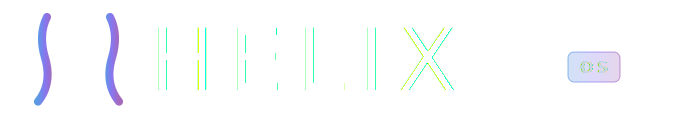
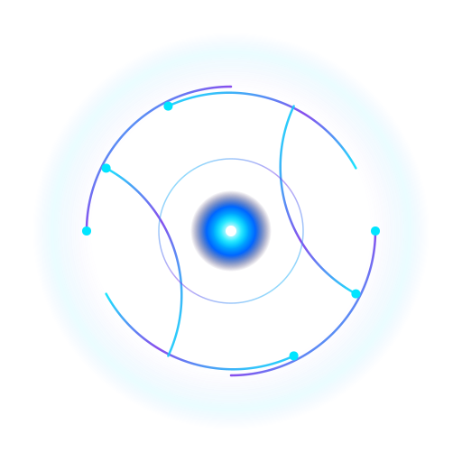
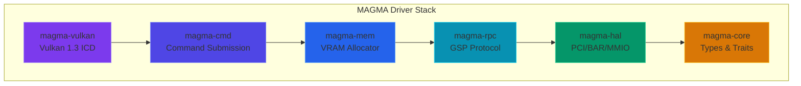
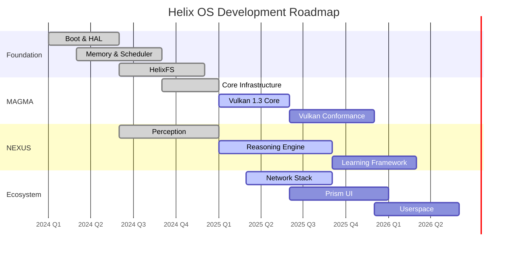

<div align="center">

<!-- ═══════════════════════════════════════════════════════════════════════════ -->
<!-- HELIX BANNER -->
<!-- ═══════════════════════════════════════════════════════════════════════════ -->

<picture>
  <source media="(prefers-color-scheme: dark)" srcset="assets/logo-banner.svg">
  <source media="(prefers-color-scheme: light)" srcset="assets/logo-banner.svg">
  
</picture>

<br/>
<br/>

### *A Next-Generation Operating System with AI-Native Architecture*

<br/>

[](LICENSE)
[](https://www.rust-lang.org/)
[](#project-status)
[](#codebase-statistics)

<br/>

[📖 Documentation](docs/) · [🏛️ Architecture](docs/ARCHITECTURE.md) · [🤝 Contributing](#contributing) · [🗺️ Roadmap](#roadmap)

<br/>

---

<br/>

<!-- ═══════════════════════════════════════════════════════════════════════════ -->
<!-- NEXUS LOGO -->
<!-- ═══════════════════════════════════════════════════════════════════════════ -->

<picture>
  <source media="(prefers-color-scheme: dark)" srcset="assets/nexus-logo-minimal.svg">
  <source media="(prefers-color-scheme: light)" srcset="assets/nexus-logo-minimal.svg">
  
</picture>

<br/>

**Powered by NEXUS** — *The Neural EXecution and Understanding System*

<br/>

</div>

---

## Introduction

**Helix OS** is a research operating system written entirely in **Rust**, designed to explore the integration of artificial intelligence at the kernel level. Unlike traditional operating systems that treat AI as an application-layer concern, Helix embeds cognitive capabilities directly into its core subsystems.

### Key Innovations

| Feature | Description |
|---------|-------------|
| 🧠 **NEXUS AI Engine** | Kernel-integrated cognitive system for adaptive resource management |
| 🌋 **MAGMA GPU Driver** | Native NVIDIA GPU driver with Vulkan 1.3 support |
| 🔄 **Hot-Reload** | Dynamic kernel module replacement without reboot |
| 🛡️ **Self-Healing** | Automatic crash recovery and fault isolation |
| 📁 **HelixFS** | Modern filesystem with journaling, encryption, and B+tree indexing |

> ⚠️ **Note**: Helix is a research platform. It is not intended for production use.

---

## Architecture

Helix follows a modular architecture where each layer has clearly defined responsibilities.

```mermaid
flowchart TB
    subgraph USER["👤 User Space"]
        APP["Applications"]
        PRISM["Prism UI Engine"]
    end

    subgraph KERNEL["🔷 Kernel Space"]
        subgraph NEXUS["🧠 NEXUS AI Layer"]
            SENSE["Perception"]
            REASON["Reasoning"]
            LEARN["Learning"]
        end

        subgraph CORE["⚙️ Kernel Core"]
            SCHED["Scheduler"]
            MEM["Memory Manager"]
            IPC["IPC / Nexus Bus"]
            VFS["VFS / HelixFS"]
        end

        subgraph DRIVERS["🔌 Drivers"]
            MAGMA["🌋 MAGMA GPU"]
            BLOCK["Block Devices"]
            NET["Network"]
        end

        subgraph HAL["🔧 Hardware Abstraction"]
            CPU["CPU / SMP"]
            MMU["MMU / Paging"]
            IRQ["Interrupts"]
            PCI["PCI / IOMMU"]
        end
    end

    subgraph HW["💻 Hardware"]
        PROC["x86_64 CPU"]
        GPU["NVIDIA GPU"]
        DISK["Storage"]
    end

    APP --> CORE
    PRISM --> MAGMA
    NEXUS <--> CORE
    CORE --> HAL
    DRIVERS --> HAL
    HAL --> HW
    MAGMA --> GPU

    style NEXUS fill:#1a1a3e,stroke:#00e5ff,stroke-width:2px
    style CORE fill:#1a2a1a,stroke:#4ade80,stroke-width:1px
    style DRIVERS fill:#2a1a2a,stroke:#f472b6,stroke-width:1px
    style HAL fill:#2a1a1a,stroke:#f97316,stroke-width:1px
```



### Layer Overview

| Layer | Components | Status |
|-------|------------|--------|
| **NEXUS AI** | Perception, Reasoning, Learning, Self-Healing | 🔵 In Development |
| **Kernel Core** | Scheduler, Memory, IPC, Syscalls | 🟢 Functional |
| **Drivers** | MAGMA (GPU), Block, Network | 🔵 In Development |
| **HAL** | x86_64 CPU, APIC, Paging, PCI | 🟢 Functional |
| **Filesystem** | HelixFS with journaling & encryption | 🟢 Functional |
| **Boot** | Limine, UEFI, Multiboot2 | 🟢 Functional |

---

## Core Components

### 🧠 NEXUS — Neural EXecution and Understanding System

NEXUS is the cognitive engine that powers Helix's adaptive behavior. It operates at the kernel level with direct access to system state.

```mermaid
flowchart LR
    subgraph NEXUS["NEXUS Cognitive Loop"]
        S["👁️ Sense"] --> U["🧩 Understand"]
        U --> R["🤔 Reason"]
        R --> D["⚡ Decide"]
        D --> A["🎯 Act"]
        A --> L["📚 Learn"]
        L --> S
    end

    style NEXUS fill:#0f172a,stroke:#00e5ff,stroke-width:2px
```



**Current Capabilities:**
- ✅ System state perception (CPU, memory, processes)
- ✅ Anomaly detection framework
- ✅ Self-healing crash recovery
- 🔵 Predictive resource allocation (in progress)
- 🔵 Workload classification (in progress)

### 🌋 MAGMA — GPU Driver

MAGMA is a from-scratch NVIDIA GPU driver designed with a GSP-first architecture.



**Implemented Crates:**
| Crate | Purpose | Status |
|-------|---------|--------|
| `magma-core` | Foundational types, traits, error handling | 🟢 Complete |
| `magma-hal` | PCI enumeration, BAR mapping, MMIO | 🟢 Complete |
| `magma-rpc` | GSP RPC protocol (50+ functions) | 🟢 Complete |
| `magma-mem` | VRAM buddy allocator (4KB-2GB) | 🟢 Complete |
| `magma-cmd` | Command rings, push buffers | 🟢 Complete |
| `magma-vulkan` | Vulkan 1.3 ICD entry points | 🔵 In Progress |

**Supported GPUs:** Turing (RTX 20xx), Ampere (RTX 30xx), Ada (RTX 40xx), Blackwell (RTX 50xx)

### 📁 HelixFS — Filesystem

A modern filesystem built for Helix with advanced features.

**Features:**
- ✅ B+tree directory indexing
- ✅ Copy-on-write journaling
- ✅ AES-256-GCM encryption
- ✅ LZ4/ZSTD compression
- ✅ Snapshots

### 🔄 Relocation Engine

Enables dynamic kernel patching and hot-reload capabilities.

**Features:**
- ✅ KASLR (Kernel Address Space Layout Randomization)
- ✅ ELF parsing and relocation
- ✅ Hot-patch infrastructure
- ✅ Module validation

---

## Project Status

### What Works ✅

| Component | Description |
|-----------|-------------|
| **Boot** | Limine and UEFI boot, framebuffer initialization |
| **HAL** | x86_64 with APIC, SMP, paging, interrupts |
| **Memory** | Physical/virtual memory management, heap allocation |
| **Scheduler** | Preemptive multitasking, priority-based scheduling |
| **IPC** | Message passing, shared memory |
| **HelixFS** | Full filesystem with journaling |
| **Hot-Reload** | Dynamic module loading/unloading |
| **MAGMA Core** | PCI, MMIO, RPC, memory allocator, command buffers |

### In Progress 🔵

| Component | Description |
|-----------|-------------|
| **NEXUS Reasoning** | AI decision engine |
| **MAGMA Vulkan** | Full Vulkan 1.3 conformance |
| **Network Stack** | TCP/IP implementation |
| **Prism UI** | Windowing and compositor |

### Planned ⚫

| Component | Description |
|-----------|-------------|
| **ARM64 Port** | AArch64 architecture support |
| **RISC-V Port** | RISC-V 64 architecture support |
| **Userspace** | POSIX-compatible environment |
| **Ray Tracing** | MAGMA RTX support |

---

## Codebase Statistics

| Metric | Value |
|--------|-------|
| **Lines of Rust** | 650,000+ |
| **Source Files** | 1,487 |
| **Crates** | 30+ |
| **NEXUS Subsystems** | 100+ modules |
| **MAGMA Crates** | 6 core + 50 planned |

---

## Getting Started

### Prerequisites

- Rust nightly (2025+)
- QEMU with KVM support
- `xorriso` for ISO creation

### Build & Run

```bash
# Clone the repository
git clone https://github.com/HelixOSFramework/helix.git
cd helix

# Install Rust toolchain
rustup default nightly
rustup target add x86_64-unknown-none
rustup component add rust-src llvm-tools-preview

# Build the kernel
./scripts/build.sh

# Run in QEMU
./scripts/run_qemu.sh
```

### Build Options

```bash
# Debug build
./scripts/build.sh --debug

# Create bootable ISO
./scripts/build.sh --iso

# Run unit tests
cargo test --target x86_64-unknown-linux-gnu --lib
```

---

## Roadmap



### Milestones

| Milestone | Target | Key Deliverables |
|-----------|--------|------------------|
| **v0.1** | Q1 2025 | Kernel boots, HelixFS functional ✅ |
| **v0.2** | Q2 2025 | MAGMA renders triangle, NEXUS perception |
| **v0.3** | Q4 2025 | Vulkan conformance, network stack |
| **v0.4** | Q2 2026 | Prism UI, userspace shell |
| **v1.0** | Q4 2026 | Production-ready research platform |

---

## Contributing

We welcome contributions from systems programmers, AI researchers, and graphics engineers.

### Areas of Interest

| Area | Skills |
|------|--------|
| **Kernel** | Rust, x86_64, memory management |
| **MAGMA** | GPU architecture, Vulkan, PCI drivers |
| **NEXUS** | ML/AI, systems modeling, optimization |
| **Prism** | Graphics, UI/UX, compositing |

### Quick Start

```bash
# Fork and clone
git clone https://github.com/YOUR_USERNAME/helix.git

# Create feature branch
git checkout -b feature/my-feature

# Make changes and test
cargo test --target x86_64-unknown-linux-gnu

# Submit PR
```

See [CONTRIBUTING.md](docs/development/CONTRIBUTING.md) for detailed guidelines.

---

## Documentation

| Document | Description |
|----------|-------------|
| [Architecture](docs/ARCHITECTURE.md) | System design overview |
| [Module Guide](docs/MODULE_GUIDE.md) | Writing kernel modules |
| [MAGMA Roadmap](drivers/gpu/magma/docs/INFINITY_ROADMAP.md) | GPU driver development plan |
| [Coding Standards](docs/development/CODING_STANDARDS.md) | Code style guidelines |
| [Debugging](docs/development/DEBUGGING.md) | Kernel debugging techniques |

---

## License

Helix OS is dual-licensed under **MIT** and **Apache 2.0**.

See [LICENSE](LICENSE) for details.

---

<br/>

<div align="center">

<!-- ═══════════════════════════════════════════════════════════════════════════ -->
<!-- FOOTER -->
<!-- ═══════════════════════════════════════════════════════════════════════════ -->

<picture>
  <source media="(prefers-color-scheme: dark)" srcset="assets/nexus-logo-minimal.svg">
  <source media="(prefers-color-scheme: light)" srcset="assets/nexus-logo-minimal.svg">
  
</picture>

<br/>
<br/>

**Helix OS**

*Intelligence at the Foundation*

<br/>

[](https://github.com/HelixOSFramework/helix)
[](docs/)

<br/>

---

<sub>Built with 🦀 Rust · Powered by 🧠 NEXUS · Accelerated by 🌋 MAGMA</sub>

</div>
