<div align="center">

<!-- ═══════════════════════════════════════════════════════════════════════════ -->
<!-- HELIX BANNER -->
<!-- ═══════════════════════════════════════════════════════════════════════════ -->

<picture>
  <source media="(prefers-color-scheme: dark)" srcset="assets/logo-banner.svg">
  <source media="(prefers-color-scheme: light)" srcset="assets/logo-banner.svg">
  
</picture>

<br/>
<br/>

### *An Experimental Operating System Architecture with Kernel-Level Artificial Intelligence*

<br/>

[](LICENSE)
[](https://www.rust-lang.org/)
[](#current-state-of-the-project)
[](#codebase-statistics)

<br/>

[📖 Documentation](docs/) · [🏛️ Architecture](docs/ARCHITECTURE.md) · [🤝 Contributing](#contributing) · [🗺️ Roadmap](#future-roadmap)

<br/>

---

<br/>

<!-- ═══════════════════════════════════════════════════════════════════════════ -->
<!-- NEXUS LOGO -->
<!-- ═══════════════════════════════════════════════════════════════════════════ -->

<picture>
  <source media="(prefers-color-scheme: dark)" srcset="assets/nexus-logo-minimal.svg">
  <source media="(prefers-color-scheme: light)" srcset="assets/nexus-logo-minimal.svg">
  
</picture>

<br/>

**Powered by NEXUS** — *The Neural EXecution and Understanding System*

<br/>

</div>

---

<br/>

## 🔮 Vision

Operating systems have remained architecturally stagnant for decades. While hardware has evolved exponentially and artificial intelligence has transformed nearly every domain of computing, the fundamental design of operating systems continues to rely on static policies, rigid schedulers, and reactive resource management.

**Helix OS Framework challenges this paradigm.**

We envision an operating system where intelligence is not an application running on top of the kernel, but a fundamental property of the kernel itself. An OS that understands workload intent before execution, adapts its behavior based on learned patterns, and optimizes system resources through continuous reasoning rather than fixed heuristics.

Helix is not an incremental improvement. It is a foundational rethinking of what an operating system can become when artificial intelligence operates at its core.

---

## 🧬 What is Helix OS Framework?

Helix is an experimental operating system architecture designed from the ground up to integrate artificial intelligence at the kernel level. It is not a traditional OS distribution, nor is it a modification of existing kernels. Helix is a research platform for exploring the next generation of system software.

**Core Characteristics:**

- **Research-Oriented**: Helix exists to explore ideas that cannot be tested within conventional OS architectures. It prioritizes experimentation and architectural innovation over production stability.

- **AI-Native Infrastructure**: Rather than treating AI as an application-layer concern, Helix embeds cognitive capabilities directly into kernel subsystems. The AI layer has privileged access to system state, scheduling decisions, memory management, and hardware interfaces.

- **Modular Architecture**: Every major subsystem in Helix is designed as a replaceable module. Schedulers, allocators, filesystems, and even components of the AI layer can be swapped, extended, or replaced without rebuilding the kernel.

- **Multi-Architecture Foundation**: Helix targets x86_64 as its primary development platform, with architectural abstractions designed to support AArch64 and RISC-V as the project matures.

---

<div align="center">

<picture>
  <source media="(prefers-color-scheme: dark)" srcset="assets/nexus-logo-minimal.svg">
  <source media="(prefers-color-scheme: light)" srcset="assets/nexus-logo-minimal.svg">
  
</picture>

</div>

## 🧠 Introducing NEXUS

At the heart of Helix lies **NEXUS** — the Neural EXecution and Understanding System.

NEXUS is not a chatbot. It is not a virtual assistant. It is a kernel-integrated cognitive layer that operates below the abstraction level of user applications, with direct access to the fundamental mechanisms of the operating system.

### What NEXUS Does

NEXUS serves as the intelligence substrate of Helix, responsible for:

| Domain | Function |
|--------|----------|
| **System Understanding** | Continuously models the state of running processes, memory pressure, I/O patterns, and hardware utilization to build a real-time understanding of system behavior |
| **Intent Recognition** | Infers the computational intent behind workloads — distinguishing between interactive, batch, real-time, and background tasks without explicit configuration |
| **Predictive Optimization** | Anticipates resource needs before they become critical, pre-allocating memory, adjusting scheduling priorities, and preparing I/O pathways |
| **Adaptive Policy** | Replaces static kernel policies with learned behaviors that evolve based on observed system patterns and outcomes |
| **Anomaly Detection** | Identifies unusual system states that may indicate bugs, security threats, or hardware degradation |

### How NEXUS Differs from Application-Level AI

Traditional AI assistants operate in user space, isolated from the kernel by privilege boundaries. They can observe limited system metrics and make suggestions, but they cannot directly influence kernel decisions.

NEXUS operates differently:

```
┌─────────────────────────────────────────────────────────────────┐
│                     Traditional AI Assistant                     │
├─────────────────────────────────────────────────────────────────┤
│  User Space    │  AI Application  ──→  System Calls  ──→  Kernel │
│                │  (Limited visibility, no direct control)        │
└─────────────────────────────────────────────────────────────────┘

┌─────────────────────────────────────────────────────────────────┐
│                          NEXUS in Helix                          │
├─────────────────────────────────────────────────────────────────┤
│  Kernel Space  │  NEXUS  ←──→  Scheduler                        │
│                │         ←──→  Memory Manager                    │
│                │         ←──→  I/O Subsystem                     │
│                │         ←──→  Hardware Abstraction              │
│                │  (Full visibility, direct integration)          │
└─────────────────────────────────────────────────────────────────┘
```

This architectural position enables NEXUS to make decisions with microsecond latency based on complete system visibility — something impossible for user-space AI systems.

---

## 🏛️ Core Architecture Overview

Helix is structured as a layered system where each layer has clearly defined responsibilities and interfaces.


### Layer Responsibilities

| Layer | Purpose |
|-------|---------|
| **Hardware** | Physical computation substrate: processors, memory, storage, peripherals |
| **Hardware Abstraction** | Architecture-specific code that presents a uniform interface to upper layers |
| **Kernel Core** | Fundamental OS mechanisms: scheduling, memory management, IPC, filesystem abstraction |
| **NEXUS AI Layer** | Cognitive subsystem that perceives system state, reasons about optimization, and influences kernel decisions |
| **System Services** | Privileged processes that provide system functionality: device managers, network stack, security services |
| **User Space** | Applications and libraries running with standard user privileges |

---

## ⚙️ System Architecture — Detailed View

The following diagram illustrates the interaction patterns between major system components.

```mermaid
flowchart LR
    subgraph NEXUS["NEXUS Cognitive Core"]
        direction TB
        SENSE["Sense<br/>──────<br/>System State<br/>Perception"]
        UNDERSTAND["Understand<br/>──────<br/>Pattern<br/>Recognition"]
        REASON["Reason<br/>──────<br/>Causal<br/>Analysis"]
        DECIDE["Decide<br/>──────<br/>Action<br/>Selection"]
        LEARN["Learn<br/>──────<br/>Model<br/>Adaptation"]

        SENSE --> UNDERSTAND --> REASON --> DECIDE
        DECIDE --> LEARN --> SENSE
    end

    subgraph KERNEL["Kernel Subsystems"]
        direction TB
        SCHED["Process Scheduler"]
        VMM["Virtual Memory"]
        IO["I/O Manager"]
        SEC["Security Monitor"]
    end

    subgraph RESOURCES["System Resources"]
        direction TB
        CPU["CPU Cores"]
        MEM["Physical Memory"]
        DISK["Storage"]
        NET["Network"]
    end

    subgraph WORKLOAD["Workloads"]
        direction TB
        PROC["Processes"]
        THR["Threads"]
        SVC["Services"]
    end

    WORKLOAD --> KERNEL
    KERNEL <--> NEXUS
    KERNEL --> RESOURCES

    NEXUS -.->|"Scheduling<br/>Hints"| SCHED
    NEXUS -.->|"Memory<br/>Predictions"| VMM
    NEXUS -.->|"I/O<br/>Optimization"| IO
    NEXUS -.->|"Threat<br/>Detection"| SEC

    style NEXUS fill:#0f172a,stroke:#00e5ff,stroke-width:2px,color:#e2e8f0
    style KERNEL fill:#1e293b,stroke:#4ade80,stroke-width:1px,color:#e2e8f0
    style RESOURCES fill:#1e293b,stroke:#f97316,stroke-width:1px,color:#e2e8f0
    style WORKLOAD fill:#1e293b,stroke:#a78bfa,stroke-width:1px,color:#e2e8f0
```



### NEXUS Integration Points

NEXUS integrates with kernel subsystems through well-defined interfaces:

**Scheduler Integration**: NEXUS provides scheduling hints based on workload classification, predicted execution time, and inter-process dependencies. The scheduler remains authoritative but incorporates NEXUS recommendations into its decisions.

**Memory Management Integration**: NEXUS predicts memory allocation patterns, suggests page eviction candidates, and identifies opportunities for memory compression or deduplication.

**I/O Optimization**: By learning application I/O patterns, NEXUS can pre-stage data, optimize request ordering, and balance load across storage devices.

**Security Monitoring**: NEXUS maintains behavioral baselines for processes and can flag anomalous activity for the security subsystem to evaluate.

---

## 💡 Key Concepts

### AI-Augmented Kernel

Traditional kernels operate on fixed algorithms with configurable parameters. An AI-augmented kernel operates on learned models that adapt to observed conditions. The distinction is fundamental:

| Traditional Kernel | AI-Augmented Kernel |
|-------------------|---------------------|
| Static scheduling policies | Adaptive scheduling based on workload patterns |
| Reactive resource allocation | Predictive resource pre-allocation |
| Threshold-based decisions | Learned decision boundaries |
| Configuration-driven behavior | Experience-driven behavior |

### Intent-Aware Computing

Most operating systems treat all processes as opaque execution units. Helix attempts to understand the *intent* behind computation:

- Is this process performing interactive work that requires low latency?
- Is this a batch job that prioritizes throughput over response time?
- Is this a background service that should yield to foreground activity?
- Is this a real-time workload with hard timing constraints?

By inferring intent, NEXUS can make scheduling and resource allocation decisions that align with what the workload actually needs, rather than relying on imperfect priority hints from applications.

### Adaptive Resource Management

Resource management in Helix is not governed by static policies but by continuously refined models:

- **Memory Pressure Response**: Rather than fixed low-memory thresholds, NEXUS learns the relationship between available memory and system responsiveness, adapting reclamation behavior accordingly.

- **CPU Frequency Scaling**: Rather than reactive governors, NEXUS anticipates computational demand and adjusts frequency proactively.

- **I/O Scheduling**: Rather than fixed algorithms, NEXUS learns which I/O patterns benefit from different scheduling strategies.

### Self-Optimizing System Behavior

Helix incorporates feedback loops that allow the system to evaluate the outcomes of its decisions:


This closed-loop architecture enables Helix to improve its behavior over time, rather than requiring manual tuning.

---

## ✨ Why Helix is Different

Helix represents a departure from conventional operating system design in several fundamental ways:

**Intelligence as Infrastructure, Not Application**

In traditional systems, AI capabilities exist in user space, isolated from kernel mechanisms. Helix treats intelligence as infrastructure — as fundamental to the OS as memory management or process scheduling.

**Learning Over Configuration**

Traditional operating systems require extensive configuration to optimize for specific workloads. Helix aims to learn optimal behavior from observation, reducing the need for manual tuning.

**Unified System Model**

Rather than treating the scheduler, memory manager, and I/O subsystem as independent components, NEXUS maintains a unified model of system state that enables coordinated optimization across subsystems.

**Research-First Design**

Helix prioritizes architectural exploration over backward compatibility. This enables investigation of ideas that would be impossible to implement within the constraints of production operating systems.

---

## 📊 Current State of the Project

Helix OS Framework is in active research and development. The current state of major components:

| Component | Status | Description |
|-----------|--------|-------------|
| **Boot Infrastructure** | Functional | Limine and UEFI boot protocols implemented |
| **Hardware Abstraction** | In Progress | x86_64 support active; ARM64 and RISC-V planned |
| **Kernel Core** | In Progress | Basic scheduling, memory management, and IPC operational |
| **Module System** | Functional | Dynamic module loading with hot-reload capability |
| **NEXUS Framework** | In Development | Cognitive architecture defined; subsystems under implementation |
| **Filesystem (HelixFS)** | Functional | B+tree based filesystem with journaling |
| **Userspace** | Planned | Minimal userspace environment not yet implemented |

### Codebase Statistics

| Metric | Value |
|--------|-------|
| Lines of Rust Code | 217,000+ |
| Source Files | 190+ |
| Kernel Modules | 24 |
| Target Architectures | 3 |

**Important**: Helix is not production-ready. It is a research platform intended for exploring next-generation OS concepts. It should not be used for any production workload.

---

## 🖥️ Supported Architectures

| Architecture | Status | Notes |
|--------------|--------|-------|
| **x86_64** | Primary | Active development target |
| **AArch64** | Planned | HAL abstractions in place |
| **RISC-V 64** | Planned | HAL abstractions in place |

---

## 🗺️ Future Roadmap

The following diagram illustrates the planned development phases for Helix:

```mermaid
gantt
    title Helix OS Framework Development Roadmap
    dateFormat YYYY-Q
    axisFormat %Y

    section Foundation
    Core Architecture           :done,    p1a, 2024-Q1, 2024-Q4
    Boot Infrastructure         :done,    p1b, 2024-Q1, 2024-Q3
    Hardware Abstraction        :active,  p1c, 2024-Q2, 2025-Q2

    section Kernel
    Memory Management           :done,    p2a, 2024-Q2, 2024-Q4
    Process Scheduler           :done,    p2b, 2024-Q3, 2025-Q1
    IPC Subsystem               :active,  p2c, 2024-Q4, 2025-Q2
    Device Driver Framework     :         p2d, 2025-Q1, 2025-Q4

    section NEXUS
    Cognitive Architecture      :active,  p3a, 2024-Q3, 2025-Q2
    Perception Subsystem        :active,  p3b, 2025-Q1, 2025-Q3
    Reasoning Engine            :         p3c, 2025-Q2, 2025-Q4
    Learning Framework          :         p3d, 2025-Q3, 2026-Q2

    section System Services
    Filesystem Services         :done,    p4a, 2024-Q2, 2025-Q1
    Network Stack               :         p4b, 2025-Q2, 2026-Q1
    Security Framework          :         p4c, 2025-Q3, 2026-Q2

    section Ecosystem
    Userspace Environment       :         p5a, 2025-Q4, 2026-Q3
    Developer Tools             :         p5b, 2026-Q1, 2026-Q4
    Documentation               :active,  p5c, 2024-Q1, 2026-Q4
```

### Phase Descriptions

**Phase 1 — Foundation**: Establish the core architectural framework, boot infrastructure, and hardware abstraction layer that all other components build upon.

**Phase 2 — Kernel Subsystems**: Implement the fundamental kernel mechanisms: memory management, process scheduling, inter-process communication, and device driver infrastructure.

**Phase 3 — NEXUS Integration**: Develop the NEXUS cognitive architecture, including perception, reasoning, decision-making, and learning subsystems, and integrate them with kernel components.

**Phase 4 — System Services**: Build the privileged services that provide high-level system functionality: filesystem services, networking, and security enforcement.

**Phase 5 — Ecosystem**: Create the userspace environment, developer tools, and comprehensive documentation needed for external contribution and experimentation.

---

## 🤝 Contributing

Helix welcomes contributions from researchers, systems programmers, and AI engineers interested in exploring the intersection of artificial intelligence and operating system design.

### Areas of Interest

- **Kernel Development**: Low-level systems programming, scheduler design, memory management algorithms
- **AI/ML Integration**: Efficient inference at kernel level, online learning, system modeling
- **Architecture Research**: Novel approaches to OS design, security models, capability systems
- **Hardware Enablement**: Driver development, architecture ports, hardware optimization
- **Documentation**: Technical writing, architecture documentation, API reference

### Getting Started

```bash
# Clone the repository
git clone https://github.com/HelixOSFramework/helix.git
cd helix

# Install dependencies (Rust nightly required)
rustup default nightly
rustup component add rust-src llvm-tools-preview

# Build the kernel
./scripts/build.sh

# Run in QEMU
./scripts/run_qemu.sh
```

See [docs/development/CONTRIBUTING.md](docs/development/CONTRIBUTING.md) for detailed contribution guidelines.

---

## 📚 Documentation

| Document | Description |
|----------|-------------|
| [Architecture Overview](docs/ARCHITECTURE.md) | Complete technical architecture documentation |
| [NEXUS Design](docs/architecture/NEXUS.md) | Detailed design of the NEXUS cognitive system |
| [Module Guide](docs/MODULE_GUIDE.md) | How to develop kernel modules for Helix |
| [OS Builder Guide](docs/OS_BUILDER_GUIDE.md) | Creating custom OS configurations with Helix |
| [Coding Standards](docs/development/CODING_STANDARDS.md) | Code style and contribution standards |
| [Debugging Guide](docs/development/DEBUGGING.md) | Kernel debugging techniques and tools |

---

## 📜 License

Helix OS Framework is dual-licensed under:

- [MIT License](LICENSE-MIT)
- [Apache License 2.0](LICENSE-APACHE)

You may choose either license for your use of this software.

---

## 🌌 Philosophy

The operating system is the foundation upon which all software rests. For decades, this foundation has been built on static assumptions: fixed scheduling policies, reactive resource management, and rigid security models. These designs reflect the limitations of their era — a time when computation was scarce and human configuration was the only path to optimization.

That era is ending.

We now possess the capability to build systems that understand themselves — that observe their own behavior, reason about optimization, and adapt without human intervention. The question is not whether AI will transform operating systems, but how deeply that transformation will reach.

Helix answers: to the kernel itself.

This is not a vision of AI replacing human judgment, but of AI extending it. An operating system that learns from its environment, that anticipates rather than reacts, that becomes more capable with every workload it observes. A system where intelligence is not a feature but a fundamental property.

Helix OS Framework is our contribution to that future.

---

<br/>

<div align="center">

<!-- ═══════════════════════════════════════════════════════════════════════════ -->
<!-- FOOTER -->
<!-- ═══════════════════════════════════════════════════════════════════════════ -->

<picture>
  <source media="(prefers-color-scheme: dark)" srcset="assets/nexus-logo-minimal.svg">
  <source media="(prefers-color-scheme: light)" srcset="assets/nexus-logo-minimal.svg">
  
</picture>

<br/>
<br/>

**Helix OS Framework**

*Redefining the Foundation of Computing*

<br/>

[](https://github.com/HelixOSFramework/helix)
[](docs/)

<br/>

---

<sub>Built with 🧠 by AI · Designed for the future of computing</sub>

</div>
