<div align="center">

<picture>
  <source media="(prefers-color-scheme: dark)" srcset="assets/logo-banner.svg">
  <source media="(prefers-color-scheme: light)" srcset="assets/logo-banner.svg">
  
</picture>

<br/>
<br/>

# 🧬 Helix OS Framework

### *An Operating System Creation Framework — Entirely Designed by Artificial Intelligence*

<br/>

[](LICENSE)
[](https://www.rust-lang.org/)
[](https://github.com/anthropics/claude)
[](#-supported-architectures)

<br/>

[📖 Documentation](docs/) • [🚀 Quick Start](#-quick-start) • [🏗️ Architecture](#-architecture) • [🤝 Contributing](#-contributing)

</div>

---

<br/>

## 🤖 A Pioneering AI-Created Project

<table>
<tr>
<td width="60%">

> **Helix OS Framework is a revolutionary project: it was entirely designed, architected, and implemented by Artificial Intelligence.**

This is not simply an AI-assisted OS — it is a demonstration of what AI can accomplish in the field of low-level systems programming. Every line of code, every architectural decision, every module was generated by advanced language models.

**Why this matters:**
- 🧠 **134,000+ lines of Rust code** generated by AI
- 🔬 **Modular microkernel architecture** algorithmically designed
- ⚡ **Kernel module hot-reload** — advanced concept implemented by AI
- 🛡️ **Capability-based security** inspired by seL4

```mermaid
flowchart TB
    subgraph AI["🤖 AI-GENERATED"]
        direction TB
        LLM["Claude Opus<br/>+ Sonnet 4"]
        LLM --> HELIX["Helix OS<br/>Framework"]
    end

    subgraph STATS["📊 Stats"]
        S1["134K+ lines Rust"]
        S2["144 source files"]
    end

    AI --> STATS

    style AI fill:#1a1a2e,stroke:#667eea,stroke-width:2px
    style LLM fill:#667eea,stroke:#764ba2,color:#fff
    style HELIX fill:#764ba2,stroke:#f093fb,color:#fff
    style STATS fill:#0d1117,stroke:#58a6ff
```

</td>
<td width="40%">



</td>
</tr>
</table>

<br/>

---

## 🎯 What is Helix?

<div align="center">

> **⚠️ Helix is NOT an operating system**
>
> **It is a FRAMEWORK for CREATING operating systems**

</div>

Think of it as a **kernel construction kit** where:

<table>
<tr>
<td align="center" width="25%">

### 🔌
### Modular
Every major component is a replaceable module

</td>
<td align="center" width="25%">

### 🔄
### Hot-Reload
Replace kernel components without rebooting

</td>
<td align="center" width="25%">

### 🏗️
### Policy-Free
The kernel makes no decisions — modules do

</td>
<td align="center" width="25%">

### 🎯
### Multi-Target
Desktop, server, embedded from the same codebase

</td>
</tr>
</table>

<br/>

---

## 🏛️ Architecture

### 7-Layer Overview

```mermaid
flowchart TB
    subgraph L7["Layer 7: USERLAND INTERFACE"]
        L7A["Applications"]
        L7B["Libraries"]
        L7C["System Calls"]
    end

    subgraph L6["Layer 6: POLICY LAYER"]
        L6A["Security Policies"]
        L6B["Resource Limits"]
        L6C["Priorities"]
    end

    subgraph L5["Layer 5: IPC / MESSAGE BUS"]
        L5A["Async Messages"]
        L5B["Shared Memory"]
        L5C["Capabilities Transfer"]
    end

    subgraph L4["Layer 4: MODULE RUNTIME & LOADER"]
        L4A["Dynamic Loading"]
        L4B["Hot Reload"]
        L4C["Dependency Resolution"]
    end

    subgraph L3["Layer 3: SUBSYSTEMS FRAMEWORK"]
        direction LR
        L3A["EXECUTION<br/>Processes<br/>Threads<br/>Scheduler"]
        L3B["MEMORY<br/>VMM<br/>Paging<br/>Allocator"]
        L3C["I/O<br/>Block<br/>Network<br/>Devices"]
        L3D["SECURITY<br/>Caps<br/>Sandboxes<br/>Crypto"]
        L3E["TIME<br/>Timers<br/>Clocks<br/>RTC"]
    end

    subgraph L2["Layer 2: KERNEL CORE (ORCHESTRATOR)"]
        L2A["Interrupt Dispatch"]
        L2B["Syscall Router"]
        L2C["Module Manager"]
    end

    subgraph L1["Layer 1: BOOT & HAL"]
        L1A["UEFI/BIOS Boot"]
        L1B["CPU Init"]
        L1C["MMU Setup"]
        L1D["Interrupt Controllers"]
        subgraph ARCH["Architectures"]
            direction LR
            A1["x86_64"]
            A2["AArch64"]
            A3["RISC-V"]
        end
    end

    L7 --> L6 --> L5 --> L4 --> L3 --> L2 --> L1

    style L7 fill:#4a90e2,stroke:#333,color:#fff
    style L6 fill:#5a9fd4,stroke:#333,color:#fff
    style L5 fill:#6ab0c6,stroke:#333,color:#fff
    style L4 fill:#7bc1b8,stroke:#333,color:#fff
    style L3 fill:#8cd2aa,stroke:#333,color:#000
    style L2 fill:#9de39c,stroke:#333,color:#000
    style L1 fill:#aef48e,stroke:#333,color:#000
```



<br/>

### 🔄 System Data Flow

```mermaid
flowchart TB
    APP["\ud83d\udcf1 Application"]

    subgraph KERNEL["KERNEL CORE"]
        direction LR
        SH["Syscall<br/>Handler"]
        MD["Module<br/>Dispatcher"]
        IPC["IPC<br/>Router"]
        SH --> MD --> IPC
    end

    subgraph MODULES["🔥 HOT-SWAPPABLE MODULES"]
        direction LR
        subgraph SCHED["Scheduler"]
            RR["Round Robin"]
            CFS["CFS"]
            RR <-.-> CFS
        end

        subgraph ALLOC["Allocator"]
            BUDDY["Buddy Alloc"]
            SLAB["Slab Alloc"]
            BUDDY <-.-> SLAB
        end

        subgraph FS["Filesystem"]
            HFS["HelixFS"]
            RAMFS["RamFS"]
            HFS <-.-> RAMFS
        end
    end

    APP -->|"syscall"| KERNEL
    KERNEL --> SCHED
    KERNEL --> ALLOC
    KERNEL --> FS

    style APP fill:#58a6ff,stroke:#333,color:#fff
    style KERNEL fill:#1a1a2e,stroke:#667eea,stroke-width:2px
    style MODULES fill:#0d1117,stroke:#f093fb,stroke-width:2px
    style SCHED fill:#2d3748,stroke:#4a90e2
    style ALLOC fill:#2d3748,stroke:#4a90e2
    style FS fill:#2d3748,stroke:#4a90e2
```



<br/>

---

## 🚀 Quick Start

### Prerequisites

\`\`\`bash
# Install Rust nightly
curl --proto '=https' --tlsv1.2 -sSf https://sh.rustup.rs | sh
rustup default nightly

# Install required tools
rustup component add rust-src llvm-tools-preview
cargo install bootimage

# QEMU for testing
sudo apt install qemu-system-x86  # Debian/Ubuntu
brew install qemu                  # macOS
\`\`\`

### 🏃 Run Helix

\`\`\`bash
# Clone the repository
git clone https://github.com/HelixOSFramework/helix.git
cd helix

# Build and run in QEMU
./scripts/run_qemu.sh

# Or in debug mode
./scripts/run_qemu.sh --debug
\`\`\`

### 🎨 Create Your Own OS

```bash
# 1. Create a new profile
mkdir -p profiles/myos
```

**2. Configure `helix.toml`:**

```toml
# profiles/myos/helix.toml

[profile]
name = "MyOS"
description = "My custom operating system"

[modules]
scheduler = "round_robin"
allocator = "buddy"
filesystem = "ramfs"
```

```bash
# 3. Build your OS
cargo build --release -p helix-myos --target x86_64-unknown-none
```

<br/>

---

## 📁 Project Structure

\`\`\`
helix/
│
├── 🥾 boot/                    # Boot protocols
│   ├── limine/                 #   └─ Limine bootloader
│   ├── multiboot2/             #   └─ Multiboot2 standard
│   └── uefi/                   #   └─ Native UEFI (134K lines!)
│
├── 🔧 hal/                     # Hardware Abstraction Layer
│   └── arch/                   #   └─ Architecture-specific
│       ├── x86_64/             #       ├─ Intel/AMD 64-bit
│       ├── aarch64/            #       ├─ ARM 64-bit
│       └── riscv64/            #       └─ RISC-V 64-bit
│
├── 💎 core/                    # Kernel Core (Orchestrator)
│   ├── orchestrator/           #   ├─ Main dispatcher
│   ├── interrupts/             #   ├─ Interrupt handling
│   ├── syscall/                #   ├─ System call table
│   └── ipc/                    #   └─ Inter-process communication
│
├── ⚙️ subsystems/              # Kernel subsystems
│   ├── execution/              #   ├─ Processes, threads, scheduling
│   ├── memory/                 #   ├─ Virtual memory, paging
│   ├── dis/                    #   ├─ Distributed Intent System (AI)
│   └── ai/                     #   └─ Artificial intelligence module
│
├── 📦 modules/                 # Module system
│   ├── loader.rs               #   ├─ Dynamic loader
│   ├── hot_reload.rs           #   ├─ Hot-reload support
│   └── registry.rs             #   └─ Module registry
│
├── 🗂️ fs/                      # HelixFS filesystem
│   ├── tree/                   #   ├─ B+ Tree storage
│   ├── journal/                #   ├─ Journaling
│   ├── snapshot/               #   ├─ CoW snapshots
│   └── crypto/                 #   └─ Built-in encryption
│
├── 🎯 profiles/                # Preconfigured OS profiles
│   └── minimal/                #   └─ Minimal configuration
│
├── 📚 docs/                    # Complete documentation
│   ├── ARCHITECTURE.md
│   ├── MODULE_GUIDE.md
│   └── OS_BUILDER_GUIDE.md
│
└── 🛠️ scripts/                 # Build/run scripts
    ├── build.sh
    ├── run_qemu.sh
    └── test.sh
\`\`\`

<br/>

---

## 🧩 Available Modules

<table>
<tr>
<th align="center">🕐 Schedulers</th>
<th align="center">🧠 Allocators</th>
<th align="center">💾 Filesystems</th>
</tr>
<tr>
<td valign="top">

| Module | Description |
|--------|-------------|
| \`round_robin\` | Simple time-sharing |
| \`cfs\` | Completely Fair (Linux) |
| \`realtime\` | FIFO/RR real-time |
| \`cooperative\` | Non-preemptive |
| \`edf\` | Earliest Deadline First |

</td>
<td valign="top">

| Module | Description |
|--------|-------------|
| \`bitmap\` | Simple bitmap |
| \`buddy\` | Buddy system |
| \`slab\` | Kernel objects |
| \`tlsf\` | Real-time O(1) |
| \`zone\` | NUMA zones |

</td>
<td valign="top">

| Module | Description |
|--------|-------------|
| \`helixfs\` | Native B+Tree FS |
| \`ramfs\` | RAM filesystem |
| \`devfs\` | Device filesystem |
| \`procfs\` | Process info |
| \`ext4\` | Linux compatibility |

</td>
</tr>
</table>

<br/>

---

## 🎯 Supported Architectures

<table>
<tr>
<td align="center" width="33%">

### 💻 x86_64


**Intel / AMD 64-bit**

- ✅ UEFI Boot
- ✅ 4-level Paging
- ✅ APIC/IOAPIC
- 🔄 SMP in progress
- 📋 ACPI planned

</td>
<td align="center" width="33%">

### 📱 AArch64


**ARM 64-bit**

- 📋 Device Tree
- 📋 GIC v3
- 📋 MMU
- 📋 Raspberry Pi 4
- 📋 Apple Silicon

</td>
<td align="center" width="33%">

### 🔬 RISC-V


**RISC-V 64-bit**

- 📋 SBI
- 📋 Sv48 paging
- 📋 PLIC
- 📋 QEMU virt
- 📋 VisionFive 2

</td>
</tr>
</table>

<br/>

---

## 📊 Project Statistics

<div align="center">

| 📊 Metric | Value |
|:--------:|:-----:|
| **Lines of Code (Rust)** | 134,673 |
| **Source Files** | 144 |
| **Modules** | 24 |
| **Architectures** | 3 |
| **Boot Protocols** | 3 |

</div>

### 📝 Code Distribution

```mermaid
pie showData
    title Lines of Code by Component
    "🧹 Boot/UEFI" : 74000
    "📁 Filesystem (HelixFS)" : 28000
    "💎 Core Kernel" : 16000
    "🔧 HAL" : 12000
    "📦 Modules" : 4000
```



<br/>

---

## 📚 Documentation

| Document | Description | Link |
|----------|-------------|------|
| 🏛️ **Architecture** | Complete technical overview | [Read →](docs/ARCHITECTURE.md) |
| 📦 **Module Guide** | How to write kernel modules | [Read →](docs/MODULE_GUIDE.md) |
| 🎨 **OS Builder** | Create your own OS with Helix | [Read →](docs/OS_BUILDER_GUIDE.md) |
| 🗺️ **Roadmap** | Project roadmap | [Read →](docs/ROADMAP.md) |
| 🐛 **Debugging** | Kernel debugging guide | [Read →](docs/development/DEBUGGING.md) |
| 📐 **Standards** | Coding conventions | [Read →](docs/development/CODING_STANDARDS.md) |

<br/>

---

## 🤝 Contributing

We welcome contributions! Although this project was created by AI, human contributions are essential for:

<table>
<tr>
<td>

**🔥 Priorities**
- Real hardware testing
- Performance optimizations
- Device drivers
- User documentation

</td>
<td>

**🎯 How to contribute**
1. Fork the repository
2. Create a feature branch
3. Commit your changes
4. Open a Pull Request

</td>
</tr>
</table>

See [CONTRIBUTING.md](CONTRIBUTING.md) for details.

<br/>

---

## 📝 License

<table>
<tr>
<td>

Helix is dual-licensed under:

- **MIT License** — [LICENSE-MIT](LICENSE-MIT)
- **Apache License 2.0** — [LICENSE-APACHE](LICENSE-APACHE)

Choose whichever license works best for your project.

</td>
<td align="center" width="40%">

**📖 OPEN SOURCE**

**MIT / Apache 2.0**

</td>
</tr>
</table>

<br/>

---

## 🙏 Acknowledgments & Inspirations

<div align="center">

| Project | Inspiration |
|---------|-------------|
| [seL4](https://sel4.systems/) | Capability-based security, formal verification |
| [Zephyr](https://zephyrproject.org/) | Modularity, configurability |
| [Redox](https://www.redox-os.org/) | Rust for OS, microkernel design |
| [Fuchsia](https://fuchsia.dev/) | Modern microkernel architecture |
| [Tock](https://www.tockos.org/) | Component isolation, embedded security |

</div>

<br/>

---

<div align="center">

<br/>

<picture>
  <source media="(prefers-color-scheme: dark)" srcset="assets/logo-banner.svg">
  <source media="(prefers-color-scheme: light)" srcset="assets/logo-banner.svg">
  
</picture>

### *The Future of Operating Systems — Designed by AI, Built for Humans*

<br/>

**[⬆ Back to top](#-helix-os-framework)**

<br/>

[](https://github.com/HelixOSFramework/helix)
[](https://twitter.com/HelixOSFw)

</div>
