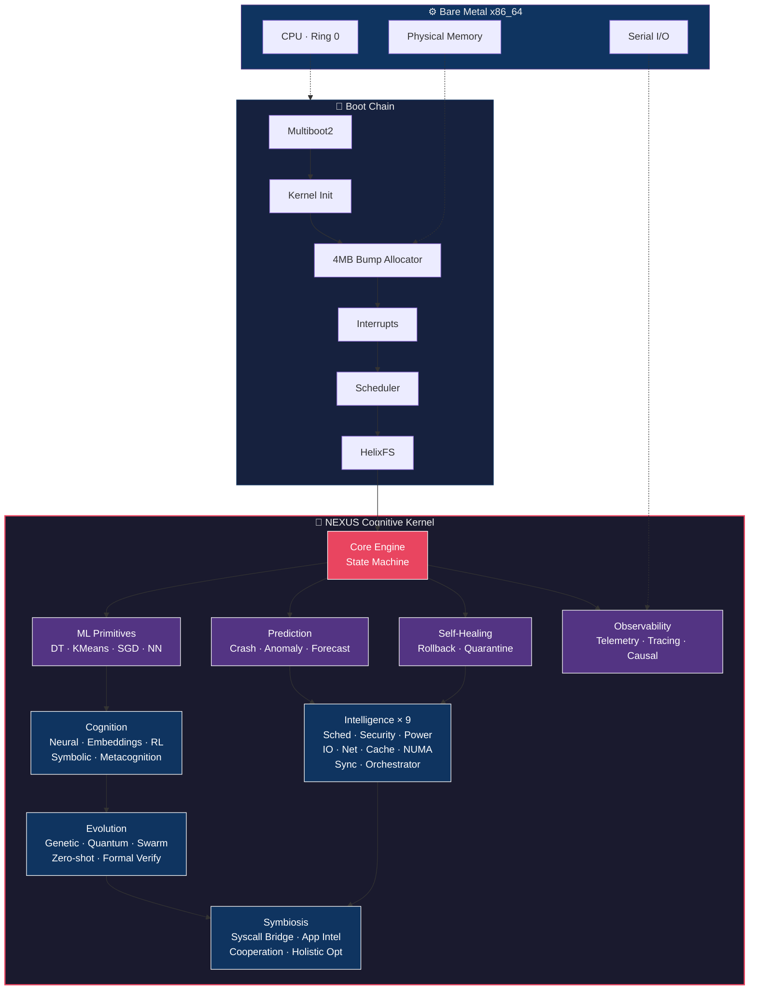
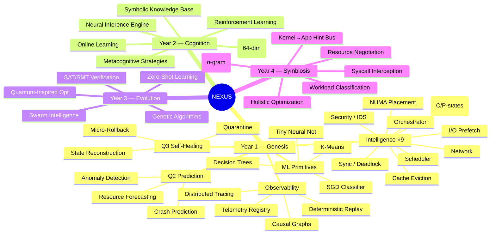
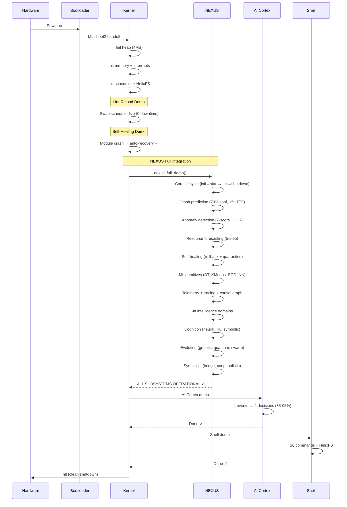
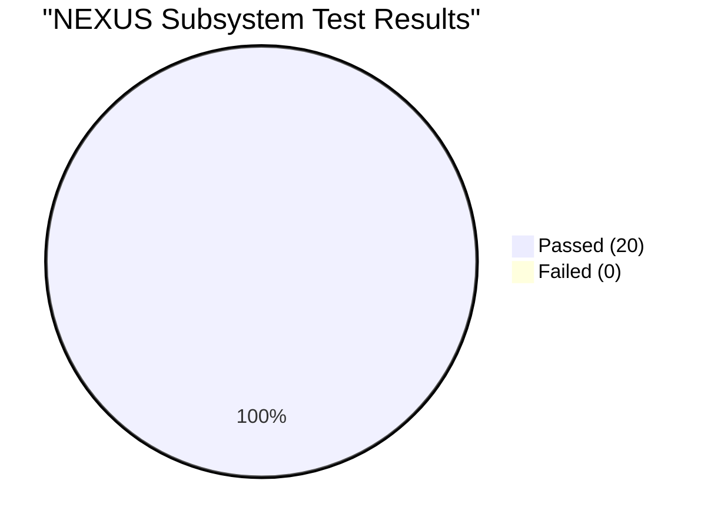
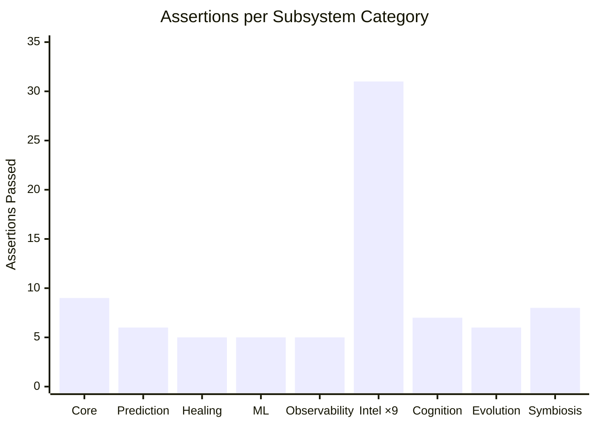
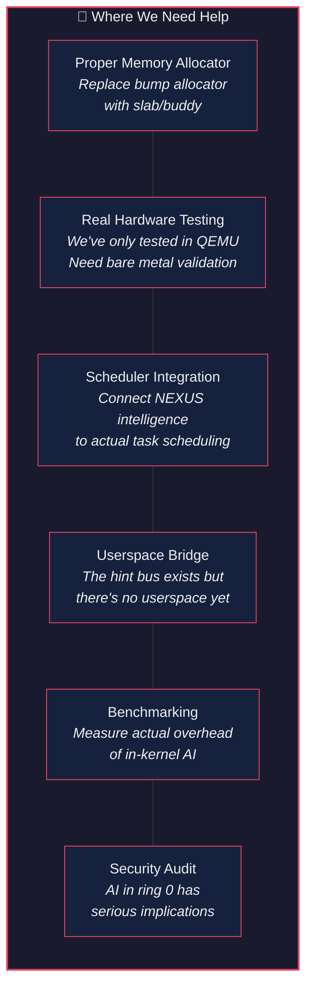

# Helix OS — We Got the Cognitive Kernel to Boot

> A `no_std` Rust kernel with 20 AI subsystems running at ring 0.
> It compiled. It booted. Nothing crashed. We're as surprised as you are.

---

## What Is This?

Helix is an experimental microkernel written entirely in Rust. Its core subsystem,
**NEXUS** (Next-generation EXecutive Unified System), embeds machine learning,
self-healing, and predictive intelligence directly in the kernel — not in userspace,
not in a driver, in the kernel itself.

On February 11, 2026, we successfully booted the full NEXUS stack for the first time.

```
20/20 subsystems initialized
116 assertions passed
0 kernel panics
406 KB binary
```

We're sharing this because we think the idea is worth exploring, and we could use
help from people smarter than us.

---

## Architecture at a Glance



---

## The NEXUS Subsystem Map



---

## Boot Sequence — What Actually Happens



---

## Test Results — February 11, 2026





| Metric | Value |
|--------|-------|
| Serial output | 885 lines |
| Total ✓ assertions | 116 |
| Kernel panics | 0 |
| Post-NEXUS regressions | 0 |
| Binary size | 406 KB |
| NEXUS source | 807,812 lines |
| Build target | `x86_64-unknown-none` |
| Rust toolchain | nightly-2025-01-15 |

---

## What's Interesting (Honestly)

We're not claiming to have built a production OS. We haven't. But a few things
happened during this integration that we think are genuinely interesting:

### The kernel predicted its own crash

We fed simulated memory pressure into the prediction engine, and it said:
*"70% chance of failure in 15 seconds."* That's a decision tree ensemble running
at ring 0, on bare metal, with no floating-point unit. It uses soft-float math.

### Quantum math works in `no_std`

```
(1+0i) × (0+1i) = 0+1i ✓
```

Complex number arithmetic for quantum-inspired optimization, running without
a standard library. Small thing, but satisfying to see.

### 800K lines compile to 406 KB

Rust's dead code elimination and LTO are remarkable. The entire NEXUS subsystem —
neural nets, genetic algorithms, SAT solvers, swarm intelligence — compiles down
to less than half a megabyte. The source-to-binary ratio is roughly 2000:1.

### Nothing crashed

The bump allocator doesn't free memory. Every `Vec`, every `String`, every struct
allocation is permanent. We had 4 MB of heap, a `no_std` environment, and 20
subsystems creating complex data structures. It all fit. Barely. (We had to shrink
the tracing buffer from 64 KB to 4 KB to make it work.)

---

## Where We Need Help

This is a research project. There's a lot we haven't figured out. If any of this
sounds interesting to you, we'd love contributors in these areas:



### Specific open questions

- **Is in-kernel ML actually useful?** We can *run* neural inference at ring 0, but
  does the latency benefit outweigh the complexity and security risk? We don't know yet.
- **Can the self-healing engine handle real failures?** It works in our demo with
  controlled crashes. Real kernel failures are messier. Much messier.
- **What's the right cognitive budget?** NEXUS has configurable memory/CPU budgets
  (4 MB–64 MB). What's the sweet spot where the AI helps more than it costs?
- **How do you formally verify an evolving kernel?** The formal verification module
  exists, but verifying a system that rewrites its own strategies is an open research problem.

---

## Getting Started

```bash
# Clone
git clone https://github.com/helix-os/helix.git
cd helix

# Build (requires Rust nightly-2025-01-15)
cargo build -p helix-minimal-os --target x86_64-unknown-none --release

# Package ISO
./scripts/build.sh step 11_package_kernel

# Boot in QEMU
qemu-system-x86_64 -machine q35 -m 256M -serial stdio \
  -display none -cdrom build/output/helix.iso -boot d -no-reboot
```

You should see all 20 NEXUS subsystems initialize, followed by the AI demo and shell.

---

## Project Structure (Relevant Parts)

```
helix/
├── profiles/minimal/src/
│   ├── main.rs              # Kernel entry, boot chain (1,696 lines)
│   └── nexus.rs             # NEXUS integration module (731 lines)
├── subsystems/nexus/        # The cognitive kernel
│   └── src/                 # 2,332 files · 807,812 lines
│       ├── core/            # State machine, lifecycle
│       ├── predict/         # Crash prediction
│       ├── anomaly/         # Statistical anomaly detection
│       ├── forecast/        # Resource forecasting
│       ├── heal/            # Self-healing engine
│       ├── ml/              # ML primitives (no_std)
│       ├── telemetry/       # Metrics, histograms
│       ├── trace/           # Distributed tracing
│       ├── causal/          # Causal graph engine
│       ├── replay/          # Deterministic replay
│       ├── scheduler/       # Scheduler intelligence
│       ├── security/        # IDS, behavioral profiling
│       ├── power/           # C-state / P-state management
│       ├── io/              # I/O intelligence
│       ├── network/         # Network intelligence
│       ├── cache/           # Cache eviction optimization
│       ├── numa/            # NUMA-aware placement
│       ├── sync/            # Contention / deadlock detection
│       ├── orchestrator/    # Central coordinator
│       ├── neural/          # Neural inference engine
│       ├── semantic/        # Embedding space
│       ├── learning/        # Online + reinforcement learning
│       ├── symbolic/        # Knowledge base / logic
│       ├── metacog/         # Metacognitive strategies
│       ├── genetic/         # Evolutionary optimization
│       ├── quantum/         # Quantum-inspired computing
│       ├── swarm/           # Stigmergy / swarm intel
│       ├── zeroshot/        # Novel situation handling
│       ├── formal/          # SAT/SMT verification
│       ├── bridge/          # Syscall interception
│       ├── apps/            # Application understanding
│       ├── coop/            # Kernel↔app cooperation
│       └── holistic/        # System-wide optimization
└── docs/reports/
    └── NEXUS_FULL_INTEGRATION_REPORT.md
```

---

## The Honest Version

This is a research prototype. The "neural network" is tiny. The "quantum optimizer"
does complex multiplication. The "genetic algorithm" hasn't evolved anything real yet.
The self-healing has only been tested with controlled crashes. The bump allocator
doesn't free memory.

But all 20 subsystems compile, boot, and run on bare metal without crashing. The
architecture is there. The foundation works. And some of the ideas — crash prediction,
causal event graphs, kernel↔app cooperation — feel like they could actually matter
someday.

If that sounds like a fun problem space, come build with us.

---

<p align="center">

**[Documentation](docs/)** · **[Architecture](docs/ARCHITECTURE.md)** · **[Contributing](CONTRIBUTING.md)** · **[Roadmap](docs/ROADMAP.md)**

</p>

<p align="center">
<i>Built with Rust · no_std · no libc · no compromises</i><br/>
<i>Helix OS Framework · February 2026</i>
</p>
