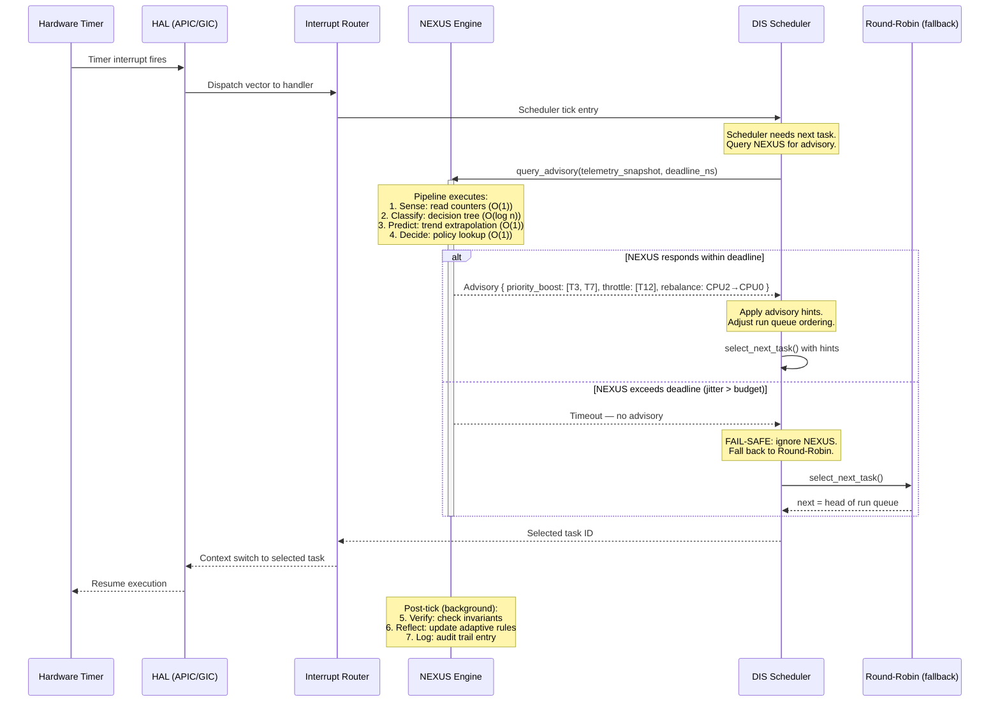
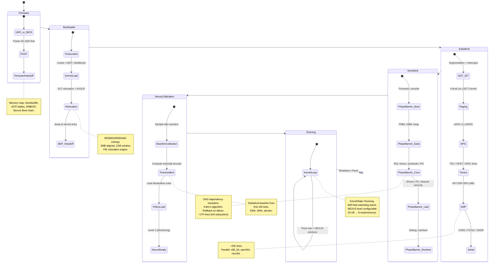

# Helix OS — Architecture

This document describes the internal architecture of the Helix kernel as it exists
in the source tree. It is written for kernel developers and subsystem maintainers.

---

## 1. Design Philosophy

### 1.1 `no_std` Rust, No Runtime

Helix compiles with `#![no_std]` on every crate. There is no Rust standard library,
no libc, no runtime. The kernel controls the allocator, the panic handler, and the
entry point. The `alloc` crate is available after heap initialization; before that,
all data structures are stack-allocated or statically placed.

The nightly channel (`nightly-2025-01-15`) is required for: `naked_functions`,
`abi_x86_interrupt`, `allocator_api`, `negative_impls`, `auto_traits`, and
`build-std` (to compile `core` and `alloc` for `x86_64-unknown-none`).

### 1.2 Mechanism, Not Policy

The kernel core provides **mechanisms** — interrupt dispatch, capability validation,
memory protection primitives, context switching, syscall gateway. It does not embed
scheduling algorithms, allocation strategies, or security policies. Those are
provided by pluggable **modules** that implement framework traits and can be
swapped at runtime via the hot-reload system.

This is the micro-kernel influence: the trusted computing base (TCB) is small
(~6.4K lines in `core/`), and everything above it is replaceable. Unlike a true
micro-kernel, subsystems run in kernel space for performance — but they are
architecturally isolated behind trait boundaries, dependency injection, and the
module registry.

### 1.3 Trait-Based Abstraction

Every hardware and subsystem boundary is defined by a trait:

```rust
// hal/src/lib.rs
pub trait HardwareAbstractionLayer: Send + Sync + 'static {
    type Cpu: CpuAbstraction;
    type Mmu: MmuAbstraction;
    type InterruptController: InterruptController;
    type Firmware: FirmwareInterface;

    fn early_init(&mut self) -> HalResult<()>;
    fn init(&mut self) -> HalResult<()>;
    fn halt(&self) -> !;
}
```

```rust
// core/src/lib.rs
pub trait KernelComponent: Send + Sync {
    fn name(&self) -> &'static str;
    fn version(&self) -> &'static str;
    fn init(&mut self) -> KernelResult<()>;
    fn shutdown(&mut self) -> KernelResult<()>;
    fn health_check(&self) -> bool;
}
```

Architecture backends implement `HardwareAbstractionLayer`. Subsystems and modules
implement `KernelComponent`. The orchestrator coordinates both through these
interfaces without knowing the concrete types.

---

## 2. System Overview

```mermaid
graph TD
    HW["<b>Hardware</b><br/>CPU · Memory · Devices · Timers"]

    subgraph HAL["HAL — Hardware Abstraction Layer"]
        direction LR
        CPU["CpuAbstraction<br/><i>CPUID, MSR, CR0-4</i>"]
        MMU["MmuAbstraction<br/><i>Page tables, TLB</i>"]
        IRQ["InterruptController<br/><i>APIC, GIC, PLIC</i>"]
        FW["FirmwareInterface<br/><i>UEFI, ACPI, DTB</i>"]
    end

    subgraph BOOT["Boot Infrastructure"]
        direction LR
        LIMINE["Limine"]
        UEFI["UEFI"]
        MB2["Multiboot2"]
        EARLY["Early Boot<br/><i>GDT, IDT, paging, SMP</i>"]
    end

    subgraph CORE["Kernel Core — TCB"]
        direction LR
        ORCH["Orchestrator<br/><i>lifecycle, capabilities</i>"]
        SYSC["Syscall Gateway"]
        IRQR["Interrupt Router"]
        HEAL["Self-Heal<br/><i>watchdog, recovery</i>"]
    end

    subgraph SUB["Subsystems — Frameworks"]
        direction LR
        MEM["Memory<br/><i>Frame, VirtAddr, zones</i>"]
        EXEC["Execution<br/><i>Thread, Process, Scheduler</i>"]
        MOD["Modules<br/><i>registry, hot-reload, ABI</i>"]
        INIT["Init<br/><i>DAG, 5-phase boot</i>"]
        FS["HelixFS<br/><i>CoW, B+tree, journal</i>"]
    end

    subgraph INTEL["NEXUS — Kernel Intelligence"]
        direction LR
        PRED["Prediction<br/><i>decision trees</i>"]
        HEALE["Healing<br/><i>rollback, quarantine</i>"]
        COG["Cognition<br/><i>coordinator, oracle</i>"]
        TEL["Telemetry<br/><i>counters, time-series</i>"]
    end

    subgraph USER["Userspace"]
        direction LR
        ELF["ELF Loader"]
        RT["Runtime"]
        SH["Shell"]
    end

    HW --> HAL
    BOOT --> HAL
    HAL --> CORE
    CORE --> SUB
    CORE --> INTEL
    SUB --> USER
    INTEL -.->|"observe + act"| SUB

    style HW fill:#1a1a2e,stroke:#e94560,color:#eee
    style HAL fill:#16213e,stroke:#0f3460,color:#eee
    style BOOT fill:#16213e,stroke:#0f3460,color:#eee
    style CORE fill:#0f3460,stroke:#e94560,color:#eee
    style SUB fill:#1a1a2e,stroke:#0f3460,color:#eee
    style INTEL fill:#1a1a2e,stroke:#e94560,color:#eee
    style USER fill:#16213e,stroke:#0f3460,color:#eee
```



**Key relationships:**

- **Hardware → HAL**: All hardware access goes through trait-based abstractions.
  No subsystem issues raw `in`/`out` or writes to MMIO directly.
- **HAL → Core**: The core kernel receives initialized hardware handles and
  coordinates subsystem startup via the init framework.
- **Core → Subsystems**: The orchestrator manages subsystem lifecycle through
  `KernelComponent`. Subsystems communicate via IPC and the event bus, not
  direct function calls.
- **NEXUS → Subsystems**: NEXUS *observes* subsystem telemetry and *acts* on
  subsystems through the healing/policy engine. The dashed arrow indicates this
  is a feedback loop, not a control dependency.

---

## 3. The NEXUS Cognitive Loop

NEXUS is the kernel intelligence subsystem. It intercepts timer ticks and uses
the inter-interrupt window to run a bounded pipeline: sense → classify → predict
→ decide → act → verify. The critical constraint is **latency**: the entire
pipeline must complete within the timer tick period, or NEXUS yields and the
kernel falls back to the last known good scheduling decision.

### 3.1 Sequence: Timer Tick with NEXUS Advisory



### 3.2 Latency Budget

The NEXUS advisory pipeline is designed for O(1) aggregate complexity. Concrete
bounds depend on architecture and timer frequency:

| Stage | Operation | Complexity | Typical x86_64 |
|:------|:----------|:-----------|:---------------|
| Sense | Read atomic counters | O(1) | ~50 ns |
| Classify | Decision tree traversal | O(log n), n = rules | ~200 ns |
| Predict | Linear trend extrapolation | O(1) | ~100 ns |
| Decide | Policy hash lookup | O(1) | ~80 ns |
| **Total** | | | **~430 ns** |

Timer tick period at 1000 Hz = 1,000,000 ns. NEXUS budget is capped at **10%**
of the tick period (100,000 ns). At ~430 ns typical, there is >200× headroom.

If the pipeline exceeds its deadline — due to cache miss storms, interrupt nesting,
or pathological decision trees — the scheduler ignores the advisory and falls back
to the baseline algorithm (round-robin or DIS multi-level queue without hints).
This is the **fail-safe invariant**: NEXUS is advisory, never authoritative. The
kernel never blocks on intelligence.

### 3.3 What This Is Not

NEXUS does not run a neural network. It does not perform gradient descent. It does
not allocate memory on the hot path. The "intelligence" is:

- **Decision trees** with bounded depth (compiled, not interpreted).
- **Exponential moving averages** over telemetry counters.
- **Threshold comparisons** with hysteresis to avoid oscillation.
- **A policy table** that maps (condition → action) with O(1) lookup.

Every decision is deterministic, explainable, and auditable. The system logs the
rule that fired, the inputs that triggered it, the confidence score, and the
selected action. There is no opaque model.

---

## 4. Boot Sequence



**State transitions are one-directional during normal boot.** The init framework
guarantees that if any phase fails, the rollback chain executes in reverse order
and the kernel halts with diagnostic output on the serial console. There is no
partial boot state — the system is either fully initialized or halted.

---

## 5. Memory Layout

The kernel uses a higher-half direct mapping (HHDM) model. Physical memory is
identity-mapped at a fixed offset in the upper half of the virtual address space.
The kernel image is loaded and relocated via KASLR within a 1 GB window.

### 5.1 Virtual Address Space (x86_64, 4-level paging, 48-bit)

| Range | Size | Region | Notes |
|:------|:-----|:-------|:------|
| `0x0000_0000_0000_0000` — `0x0000_7FFF_FFFF_FFFF` | 128 TiB | **Userspace** | Per-process, SMAP/SMEP protected |
| `0x0000_8000_0000_0000` — `0xFFFF_7FFF_FFFF_FFFF` | — | Non-canonical hole | Hardware-enforced gap |
| `0xFFFF_8000_0000_0000` — `0xFFFF_BFFF_FFFF_FFFF` | 64 TiB | **HHDM (physmem)** | Direct mapping of all physical RAM |
| `0xFFFF_C000_0000_0000` — `0xFFFF_CFFF_FFFF_FFFF` | 16 TiB | **Kernel heap** | Grows upward, guard pages between slabs |
| `0xFFFF_D000_0000_0000` — `0xFFFF_DFFF_FFFF_FFFF` | 16 TiB | **MMIO mappings** | Device register windows, framebuffers |
| `0xFFFF_E000_0000_0000` — `0xFFFF_EFFF_FFFF_FFFF` | 16 TiB | **Module space** | Hot-loaded module code/data |
| `0xFFFF_F000_0000_0000` — `0xFFFF_FFFF_7FFF_FFFF` | ~16 TiB | **Reserved** | Future use (recursive paging, per-CPU) |
| `0xFFFF_FFFF_8000_0000` — `0xFFFF_FFFF_C000_0000` | 1 GiB | **Kernel image** | KASLR: 2MB-aligned, ~256K slots |
| `0xFFFF_FFFF_C000_0000` — `0xFFFF_FFFF_FFFF_FFFF` | 1 GiB | **Kernel stacks** | Per-CPU + IST stacks, guard pages |

### 5.2 Physical Memory Zones

The memory subsystem (`subsystems/memory/`) defines zones for the physical allocator:

| Zone | Range | Purpose |
|:-----|:------|:--------|
| DMA | 0 — 16 MiB | Legacy ISA DMA (24-bit addressing) |
| DMA32 | 16 MiB — 4 GiB | 32-bit device DMA |
| Normal | 4 GiB — end | General purpose allocation |
| High | above Normal | Systems with >4 GiB, accessed via HHDM |
| Device | varies | MMIO regions, non-cacheable |

### 5.3 Page Sizes

| Size | x86_64 | aarch64 | riscv64 | Use |
|:-----|:-------|:--------|:--------|:----|
| 4 KiB | PTE | 4K granule | Sv39/48/57 | Default, userspace |
| 2 MiB | PDE (huge) | 2M block | Sv39/48/57 | Kernel image, HHDM |
| 1 GiB | PDPTE (huge) | 1G block | Sv39/48/57 | Large HHDM ranges |
| 16 KiB | — | 16K granule | — | aarch64 optional |
| 64 KiB | — | 64K granule | — | aarch64 optional |

The paging framework (`hal/src/arch/x86_64/paging_v2/`) supports both 4-level
and 5-level (LA57) paging. TLB management includes PCID for per-process TLB
tagging, avoiding full flushes on context switch.

---

## 6. Subsystem Isolation Model

Subsystems are not micro-kernel servers — they run in ring 0 for performance.
Isolation is enforced at the **architectural** level, not the hardware level:

1. **Trait boundaries.** Subsystems interact through trait objects and typed
   channels. There are no global mutable statics shared across subsystem
   boundaries (except the kernel state atomic).

2. **Module registry.** All module instances are registered with the module
   system (`modules/`), which tracks dependencies, enforces ABI version
   compatibility, and mediates hot-reload. A module cannot call another
   module's internal functions — only its published trait interface.

3. **Event bus.** Cross-subsystem communication uses the NEXUS event bus
   (30+ event types, 5 priority levels) or the core IPC primitives. Direct
   function calls across crate boundaries are limited to the HAL and core
   APIs.

4. **Self-heal.** The watchdog (`core/src/selfheal.rs`) monitors every
   registered `KernelComponent` via periodic `health_check()` calls. If a
   component fails — crash, hang, or degraded health — the recovery manager
   can restart it, fail over to a backup, or isolate it. This is the
   operational equivalent of micro-kernel process restart, implemented
   in-kernel.

```
Isolation boundary (enforced by trait + module registry):

┌─────────────┐     ┌─────────────┐     ┌─────────────┐
│  Scheduler  │     │  Allocator  │     │  FS Driver  │
│  (module)   │     │  (module)   │     │  (module)   │
├─────────────┤     ├─────────────┤     ├─────────────┤
│ trait iface │     │ trait iface │     │ trait iface │
└──────┬──────┘     └──────┬──────┘     └──────┬──────┘
       │                   │                   │
       └───────────────────┼───────────────────┘
                           │
                    ┌──────▼──────┐
                    │  Module     │
                    │  Registry   │
                    │  + ABI      │
                    │  + Hot-     │
                    │    Reload   │
                    └──────┬──────┘
                           │
                    ┌──────▼──────┐
                    │  Kernel     │
                    │  Core (TCB) │
                    └─────────────┘
```

---

## 7. Crate Dependency Graph

The workspace enforces a strict layering. Lower layers never depend on upper layers.

```
boot/{limine,uefi,multiboot2}
  └── hal
       └── core
            ├── subsystems/memory     (depends on: hal)
            ├── subsystems/execution  (depends on: hal)
            ├── subsystems/dis        (depends on: execution)
            ├── subsystems/nexus      (depends on: nexus-types, nexus-core)
            ├── subsystems/init       (depends on: hal, core)
            ├── subsystems/relocation (depends on: hal)
            ├── subsystems/userspace  (depends on: execution, memory)
            ├── modules               (depends on: core)
            └── fs                    (depends on: hal)
```

`nexus-types` and `nexus-core` are leaf crates with no internal dependencies
beyond `core` and `alloc`. This allows any subsystem to consume NEXUS type
definitions without pulling in the full 320K-line NEXUS monolith.

---

## 8. Multi-Architecture Support

Three architecture targets are implemented in the HAL:

| Arch | HAL | Early Boot | Paging | Interrupt Controller | Timer | SMP |
|:-----|:----|:-----------|:-------|:---------------------|:------|:----|
| x86_64 | CPUID, MSR, CR0-4, GDT/IDT/TSS | ~3.5K lines | 4/5-level, PCID | xAPIC, x2APIC, I/O APIC, MSI/MSI-X | TSC, HPET, APIC, PIT | INIT-SIPI-SIPI, per-CPU GS |
| aarch64 | System registers, EL0-3 | ~3.5K lines | 4KB/16KB/64KB granule | GICv2, GICv3 (auto-detect) | Generic Timer | PSCI 0.2+, MPIDR, SGI |
| riscv64 | CSRs, M/S/U modes | ~3.6K lines | Sv39/Sv48/Sv57 | PLIC, CLINT | MTIME/MTIMECMP, SBI | SBI HSM, per-hart TP |

The `#[cfg(target_arch = "...")]` mechanism selects the correct backend at compile
time. The `arch_stubs` module provides no-op fallbacks for cross-compilation checks.

---

## 9. Where Consciousness Emerges

There is no single module labelled "consciousness." The property emerges from the
compound effect of several feedback loops operating simultaneously:

1. **Telemetry** collects counters from every subsystem — allocation rates,
   scheduling latencies, interrupt frequencies, cache hit ratios.

2. **Anomaly detection** computes exponential moving averages and flags
   deviations beyond adaptive thresholds.

3. **Prediction** extrapolates trends and estimates time-to-failure using
   bounded decision trees.

4. **Healing** pre-stages rollback actions and tests them on isolated
   subsystem snapshots (canary analysis) before applying to production state.

5. **Reflection** scores the accuracy of past predictions against observed
   outcomes and adjusts heuristic parameters.

6. **Meta-reflection** (level 6, opt-in) evaluates the quality of the
   reflection process itself — the optimizer optimizing the optimizer.

Each layer feeds into the next. At depth 1, this is a control loop. At depth 2,
it is an adaptive control loop. At depth 3+, the engineering distinction between
"very good systems engineering" and "self-awareness" becomes a question of
vocabulary, not architecture.

The kernel does not claim consciousness. It claims a sufficiently advanced
feedback loop — bounded, deterministic, transparent, and always fail-safe.

---

## Further Reading

- [ROADMAP.md](ROADMAP.md) — current implementation status checklist.
- [NEXUS_EVOLUTION.md](NEXUS_EVOLUTION.md) — NEXUS intelligence subsystem trajectory.
- [PROJECT_STRUCTURE.md](PROJECT_STRUCTURE.md) — file-level directory guide.
- [../CONTRIBUTING.md](../CONTRIBUTING.md) — development workflow and code standards.
