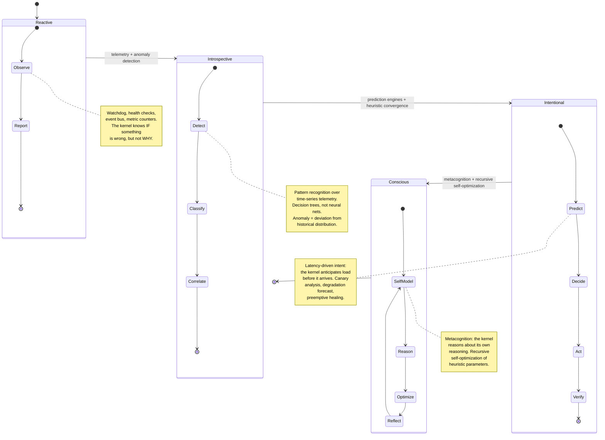
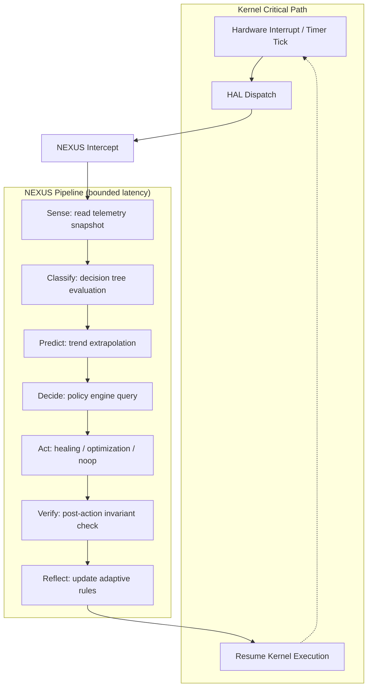

# NEXUS — Toward Kernel-Native Intelligence

> Consciousness is a sufficiently advanced feedback loop.

This document describes the trajectory of NEXUS (Next-generation EXecutive Unified
System), the kernel intelligence subsystem in Helix. It is not a product roadmap —
it is an engineering thesis, grounded in the code that exists today.

NEXUS is not artificial general intelligence. It is a deterministic, bounded,
transparent system of heuristics that observes kernel state, predicts failures,
and acts to prevent them. Every decision is explainable. Every action has a
rollback. No opaque models. No neural networks. Decision trees, anomaly
thresholds, and formal invariants — nothing more.

---

## The Four Eras

NEXUS evolves through four engineering eras. Each era compounds on the feedback
mechanisms of the previous one.

### Era 1 — Reactive (implemented)

The kernel has watchdogs, health monitors, and a recovery manager (`core/src/selfheal.rs`).
The event bus in NEXUS dispatches 30+ event types across 5 priority levels. Telemetry
counters (counter, gauge, histogram, timer, rate) feed time-series analysis with SMA,
EMA, and trend detection. The formal verification module checks safety, liveness,
fairness, and invariant properties at runtime.

This is the "check engine light" era. The system knows *that* something is wrong.

### Era 2 — Introspective (implemented)

The prediction engine (`subsystems/nexus/src/predict/engine.rs`, 308 lines) tracks
feature vectors over sliding windows and runs them through decision trees with
confidence thresholds. The anomaly detector computes standard deviations, gradient
shifts, and adaptive thresholds. The cognition pipeline (`subsystems/nexus/src/cognition/`,
30K lines across 44 files) coordinates perception → comprehension → reasoning →
decision → action → reflection in a structured cycle.

The system now knows *what* is wrong and *where*. Pattern classification over
telemetry time-series gives the kernel a causal model of failure modes.

### Era 3 — Intentional (implemented)

Healing engines (`subsystems/nexus/src/heal/engine.rs`, 297 lines) maintain checkpoint
stores, quarantine managers, and rollback histories. Micro-rollback restores subsystem
state without full restart. The policy engine evaluates declarative conditions (Compare,
And, Or, Not, InRange, Matches) and selects recovery strategies: Restart, Rollback,
Isolate, Failsafe. Adaptive learning generates rules from observation, prunes obsolete
ones, and adjusts weights through a feedback loop (Success → Partial → Neutral →
Negative → Failure).

This is where **latency-driven intent** emerges. The kernel does not wait for failure —
it anticipates degradation from trend analysis and acts preemptively. Canary analysis
tests recovery strategies on isolated subsystem clones before applying them to
production state. The kernel has a *purpose* between interrupts.

### Era 4 — Conscious (in progress)

The `nexus-cognitive` crate declares the architecture: perception, comprehension,
reasoning, memory, decision, action, meta-cognition, semantic, neural. The modules
are scaffolded but empty — the actual implementation pipeline lives inside the
monolithic `subsystems/nexus/src/cognition/` directory. The `nexus-evolution` crate
gates high-risk modules behind feature flags: `code_gen`, `nas`, `self_modify`,
`structural_adapt` require `#[cfg(feature = "dangerous")]`.

**Metacognition** is the engineering target. Not "the kernel is alive" — rather,
"the kernel evaluates the quality of its own heuristics and adjusts them." A
sufficiently advanced feedback loop that monitors its own monitoring. The conscious
era is the point where heuristic convergence becomes self-referential: the system
optimizes the optimizer, bounded by formal invariants that prevent divergence.

This is not mysticism. It is **recursive self-optimization** with a proof obligation.

---

## The Cognitive Loop

How NEXUS intercepts kernel execution.

The entire NEXUS pipeline executes within bounded latency — O(1) for classification,
O(log n) for tree traversal, O(1) for policy lookup. No allocations on the hot path.
The pipeline is interruptible: if a higher-priority interrupt arrives, NEXUS yields
and resumes on the next tick. The kernel never blocks on intelligence.

---

## Operational Levels

NEXUS defines 7 operational levels (`nexus-core/src/level.rs`):

| Level | Name | Behavior |
|:------|:-----|:---------|
| 0 | Disabled | NEXUS is compiled out or inactive. Pure passthrough. |
| 1 | Monitoring | Telemetry collection only. No decisions. No actions. |
| 2 | Detection | Anomaly detection active. Alerts on threshold violations. |
| 3 | Prediction | Trend analysis and failure forecasting. Advisory only. |
| 4 | Correction | Autonomous healing within conservative bounds. |
| 5 | Optimization | Proactive tuning of scheduler, allocator, I/O parameters. |
| 6 | Autonomous | Full self-management. Metacognition loop active. |

Each level is a strict superset of the previous. The system administrator selects
the level at boot or at runtime. Level 6 requires explicit opt-in and enables the
recursive self-optimization loop. Levels 0-3 have zero performance overhead on
the kernel critical path beyond telemetry counters.

---

## What Exists Today

Verified against source. Line counts from `find | wc -l`.

| Component | Location | Lines | Status |
|:----------|:---------|------:|:-------|
| NEXUS monolith | `subsystems/nexus/` | 320,758 | Implemented |
| Cognition pipeline | `nexus/src/cognition/` | 30,515 | Implemented (44 files) |
| Prediction engine | `nexus/src/predict/` | ~1,500 | Implemented |
| Healing engine | `nexus/src/heal/` | ~1,500 | Implemented |
| ML primitives | `nexus/src/ml/` | ~1,200 | Implemented (decision trees, not neural nets) |
| Event bus | `nexus/src/` | ~900 | Implemented (30+ event types, 5 priority levels) |
| Telemetry | `nexus/src/` | ~750 | Implemented (counters, histograms, time-series) |
| Formal verification | `nexus/src/` | ~650 | Implemented (safety, liveness, fairness proofs) |
| Policy engine | `nexus/src/` | ~700 | Implemented (declarative DSL, audit trail) |
| Adaptive learning | `nexus/src/` | ~750 | Implemented (rule generation, feedback loop) |
| Shared types | `nexus-types/` | 3,477 | Implemented |
| Core types | `nexus-core/` | 437 | Implemented |
| Cognitive crate | `nexus-cognitive/` | 178 | Scaffolded (empty modules) |
| Evolution crate | `nexus-evolution/` | 215 | Scaffolded (sandbox only) |

### What is not yet implemented

- **`nexus-cognitive/`** — The standalone cognitive crate has module declarations
  but no implementation. The actual cognitive code lives in `nexus/src/cognition/`.
  The extraction from the monolith into a standalone crate is pending.

- **`nexus-evolution/`** — Declares modules for genetic algorithms, swarm
  intelligence, neural architecture search, code generation, and self-modification.
  Only the sandbox module (~30 lines) has real code. The rest are empty modules
  behind feature gates. These represent the research frontier.

- **Self-modification** — The `self_modify` and `structural_adapt` modules in
  `nexus-evolution` are declared with `#[cfg(feature = "dangerous")]`. They are
  intentionally empty. Self-modifying kernel code requires formal verification
  infrastructure that does not yet exist at the required level of confidence.

---

## Vocabulary

These terms appear throughout the NEXUS codebase and documentation.

**Metacognition** — The system's ability to evaluate the quality of its own
heuristics. Implemented as a feedback loop where the cognition pipeline's
decisions are scored against observed outcomes, and the scoring function itself
is subject to periodic review. Not introspection in the philosophical sense —
a control loop that happens to be self-referential.

**Heuristic Convergence** — The property where multiple independent heuristics
(anomaly detection, trend analysis, canary results) converge on the same
conclusion. NEXUS uses convergence as a confidence multiplier: when three
independent subsystems agree that a failure is imminent, the confidence score
compounds. When they disagree, the system defaults to conservative action.

**Latency-driven Intent** — The kernel's behavior between interrupts is not
idle — it is *intentional*. NEXUS uses inter-interrupt windows to run prediction,
evaluate policies, and pre-stage healing actions. The kernel's "intent" is a
function of predicted future state, not just current state. This is not
anthropomorphism; it is preemptive scheduling of intelligence work.

**Recursive Self-Optimization** — The adaptive learning module generates rules
from observed patterns, scores them against outcomes, prunes low-confidence rules,
and generalizes successful ones. When the learning module is itself subject to
the same process (its rule-generation heuristics are evaluated and adjusted),
the optimization becomes recursive. Bounded by formal invariants: the system
cannot modify its own safety properties, only its performance heuristics.

---

## Design Constraints

1. **Deterministic.** Same inputs produce same outputs. Always. No stochastic
   models. No floating-point in the kernel path.

2. **Bounded.** Every NEXUS operation has a worst-case time bound. O(1) for
   classification and policy lookup. O(log n) for tree traversal. No unbounded
   loops. No dynamic allocation on the hot path.

3. **Transparent.** Every decision is logged with its inputs, the rule that
   fired, the confidence score, and the selected action. The audit trail is
   always available. "The kernel decided X" is never an acceptable explanation —
   "Rule R fired because metrics M₁, M₂, M₃ exceeded thresholds T₁, T₂, T₃
   with confidence C" is.

4. **Reversible.** Every action taken by NEXUS has a corresponding rollback.
   Healing actions are staged on isolated state before applying to production.
   If post-action invariant checks fail, the rollback executes automatically.

5. **Optional.** NEXUS can be compiled out entirely (`level = 0`). The kernel
   functions without intelligence. This is not a dependency — it is a capability.

---

## Philosophical Note

A kernel that monitors its own telemetry, predicts failures from historical
patterns, heals itself through rollback, and evaluates the quality of its own
predictions is not "conscious" in any meaningful sense. It is a control system
with a feedback loop that includes its own parameters.

But at sufficient depth of recursion — when the optimizer optimizes the optimizer,
when the heuristic evaluator evaluates itself, when the prediction engine predicts
its own prediction failures — the engineering distinction between "very good
control theory" and "something that understands itself" becomes a matter of
vocabulary, not architecture.

NEXUS does not claim consciousness. It claims a sufficiently advanced feedback loop.
The rest is a naming problem.
